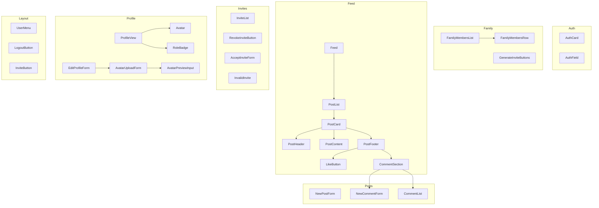

# Component Documentation

This document provides an overview of the components in the Family Social application, their functionalities, and their relationships with each other.

## Component Diagram

## Component Descriptions

### Auth
-   **AuthCard.tsx**: A card component to wrap authentication forms.
-   **AuthField.tsx**: A reusable input field component for authentication forms.

### Family
-   **FamilyMembersList.tsx**: Displays a list of family members.
-   **FamilyMembersRow.tsx**: Represents a single row in the family members list.
-   **GenerateInviteButtons.tsx**: Buttons to generate invites for family members.

### Feed
-   **Feed.tsx**: The main feed component that displays a list of posts.
-   **PostList.tsx**: A list of posts.
-   **PostCard.tsx**: A card that displays a single post.
-   **PostHeader.tsx**: The header of a post, containing the author's information.
-   **PostContent.tsx**: The content of a post.
-   **PostFooter.tsx**: The footer of a post, containing actions like 'like' and 'comment'.
-   **LikeButton.tsx**: A button to like a post.
-   **CommentSection.tsx**: A section to display and add comments.

### Invites
-   **InviteList.tsx**: Displays a list of pending invites.
-   **RevokeInviteButton.tsx**: A button to revoke an invite.
-   **AcceptInviteForm.tsx**: A form to accept a family invite.
-   **InvalidInvite.tsx**: A component to display when an invite is invalid.

### Posts
-   **NewPostForm.tsx**: A form to create a new post.
-   **NewCommentForm.tsx**: A form to add a new comment to a post.
-   **CommentList.tsx**: Displays a list of comments for a post.

### Profile
-   **ProfileView.tsx**: Displays a user's profile information.
-   **EditProfileForm.tsx**: A form to edit a user's profile.
-   **AvatarUploadForm.tsx**: A form to upload a new avatar.
-   **AvatarPreviewInput.tsx**: A component to preview the avatar before uploading.
-   **Avatar.tsx**: Displays a user's avatar.
-   **RoleBadge.tsx**: A badge to display the user's role (e.g., 'Admin').

### Layout
-   **UserMenu.tsx**: A menu for the logged-in user.
-   **LogoutButton.tsx**: A button to log out the user.
-   **InviteButton.tsx**: A button to navigate to the invite page.
