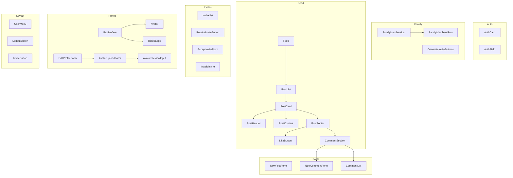

# Component Documentation

This document provides an overview of the components in the Family Social application, their functionalities, and their relationships with each other.

## Component Diagram

```mermaid
graph TD
    subgraph "Auth"
        A1[AuthCard]
        A2[AuthField]
    end

    subgraph "Family"
        B1[FamilyMembersList]
        B2[FamilyMembersRow]
        B3[GenerateInviteButtons]
    end

    subgraph "Feed"
        C1[Feed]
        C2[PostList]
        C3[PostCard]
        C4[PostHeader]
        C5[PostContent]
        C6[PostFooter]
        C7[LikeButton]
        C8[CommentSection]
    end

    subgraph "Invites"
        D1[InviteList]
        D2[RevokeInviteButton]
        D3[AcceptInviteForm]
        D4[InvalidInvite]
    end

    subgraph "Posts"
        E1[NewPostForm]
        E2[NewCommentForm]
        E3[CommentList]
    end

    subgraph "Profile"
        F1[ProfileView]
        F2[EditProfileForm]
        F3[AvatarUploadForm]
        F4[AvatarPreviewInput]
        F5[Avatar]
        F6[RoleBadge]
    end

    subgraph "Layout"
        G1[UserMenu]
        G2[LogoutButton]
        G3[InviteButton]
    end

    C1 --> C2;
    C2 --> C3;
    C3 --> C4;
    C3 --> C5;
    C3 --> C6;
    C6 --> C7;
    C6 --> C8;
    C8 --> E2;
    C8 --> E3;

    F1 --> F5;
    F1 --> F6;
    F2 --> F3;
    F3 --> F4;

    B1 --> B2;
```

## Component Descriptions

### Auth
-   **AuthCard.tsx**: A card component to wrap authentication forms.
-   **AuthField.tsx**: A reusable input field component for authentication forms.

### Family
-   **FamilyMembersList.tsx**: Displays a list of family members.
-   **FamilyMembersRow.tsx**: Represents a single row in the family members list.
-   **GenerateInviteButtons.tsx**: Buttons to generate invites for family members.

### Feed
-   **Feed.tsx**: The main feed component that displays a list of posts.
-   **FeedStreamView.tsx**: Filter tabs manager for moments and skeletons.
-   **HearthComposer.tsx**: Client memory composer with client-side EXIF metadata sanitization, multi-photo upload (up to 6 photos), and circular thumbnail removal buttons.
-   **PostList.tsx**: A list of posts forwarding active user context and roles.
-   **PostCard.tsx**: A card that displays a single post with photo mosaic grid, fullscreen lightbox integration, author/admin dropdown actions, inline editing with selective photo pruning, cascade deletion confirmation, and `• (edited)` tag.
-   **PhotoMosaicGrid.tsx**: Adaptive editorial photo mosaic grid (1 hero, 2 split, 3 split-column, 4+ grid with `+{remainingCount} more` badge).
-   **PhotoLightboxModal.tsx**: Fullscreen touch-enabled lightbox viewer via React Portal with mobile swipe gestures, English pagination (`${currentIndex + 1} / ${photos.length}`), keyboard shortcuts, and double-tap zoom.
-   **PostHeader.tsx**: The header of a post, containing the author's information.
-   **PostContent.tsx**: The content of a post.
-   **PostFooter.tsx**: The footer of a post, containing actions like 'like' and 'comment'.
-   **LikeButton.tsx**: A button to like a post.
-   **CommentSection.tsx**: A section to display and add comments, managing current user identity and permissions.

### Invites
-   **InviteList.tsx**: Displays a list of pending invites.
-   **RevokeInviteButton.tsx**: A button to revoke an invite.
-   **AcceptInviteForm.tsx**: A form to accept a family invite.
-   **InvalidInvite.tsx**: A component to display when an invite is invalid.

### Posts
-   **NewPostForm.tsx**: A form to create a new post.
-   **NewCommentForm.tsx**: A form to add a new comment to a post.
-   **CommentList.tsx**: Displays a list of comments for a post with inline comment editing, deletion confirmation, author/admin permissions, and `• (edited)` status indicator.

### Profile
-   **ProfileView.tsx**: Displays a user's profile information.
-   **EditProfileForm.tsx**: A form to edit a user's profile.
-   **AvatarUploadForm.tsx**: A form to upload a new avatar.
-   **AvatarPreviewInput.tsx**: A component to preview the avatar before uploading.
-   **Avatar.tsx**: Displays a user's avatar with strict 1:1 circular aspect ratio (`aspect-square shrink-0 rounded-full overflow-hidden`).
-   **RoleBadge.tsx**: A badge to display the user's role (e.g., 'Admin').

### Layout & Navigation
-   **HearthHeader.tsx**: Living room canopy header with family crest, banner backdrop, generation vitals, and member facepile.
-   **MobileBottomNav.tsx**: Fixed mobile bottom navigation bar (`Living Room`, `Family Tree`, `Events`, `Profile`) visible on `< 1024px` screens with safe area insets, mounted state hydration guard, and circular user avatar.
-   **ThemeToggle.tsx**: Floating high-contrast theme toggle positioned safely above mobile bottom navigation (`bottom-20 lg:bottom-6`) with `suppressHydrationWarning`.
-   **UserMenu.tsx**: A menu for the logged-in user with circular avatar trigger.
-   **LogoutButton.tsx**: A button to log out the user.
-   **InviteButton.tsx**: A button to navigate to the invite page.

