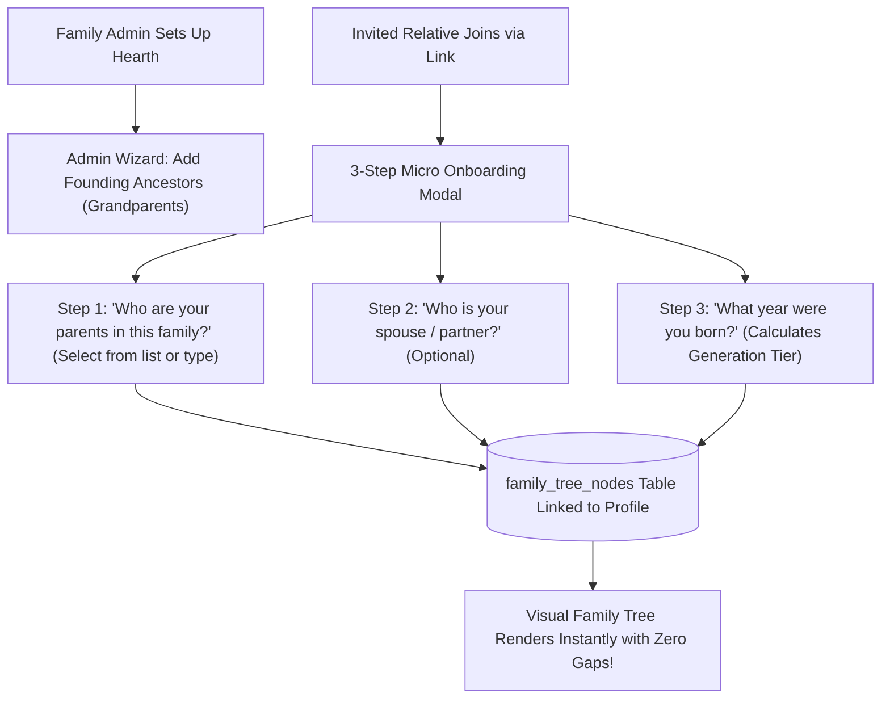

# 📋 Kinship: Delivered Functionalities & Proposed Features Specification

> **Document Type:** Living Product Lifecycle, System Deliverables Ledger & Technical Feature Roadmap  
> **Current Platform Version:** `2.5.0` (Production Ready — Sprint 1 Delivered)  
> **Tech Stack:** Next.js 16 (App Router), React 19, Tailwind CSS v4, PostgreSQL (`pg`), Drizzle ORM, NextAuth.js (JWT Strategy)  
> **Core Architecture:** Multi-Tenant Intimate Sanctuary isolated by `family_id` with Sovereign Platform Superadmin Governance  
> **Document Status:** Active Engineering & Product Single Source of Truth (SSOT) — Amended for Initial Stage Pragmatism  

---

## 📑 Table of Contents

1. [Document Purpose & Initial Stage Strategy](#1-document-purpose--initial-stage-strategy)
2. [Delivered Functionalities Inventory (v1.0.0 – v2.5.0)](#2-delivered-functionalities-inventory-v100--v250)
   - [2.1 Core Authentication & Session Engine](#21-core-authentication--session-engine)
   - [2.2 Atomic Founding Organizer Genesis & Onboarding](#22-atomic-founding-organizer-genesis--onboarding)
   - [2.3 Cryptographic Kinship Invitation & Multi-Path Acceptance Engine](#23-cryptographic-kinship-invitation--multi-path-acceptance-engine)
   - [2.4 Family Sanctuary Branding & Customization](#24-family-sanctuary-branding--customization)
   - [2.5 The Digital Living Room Feed & Memory Preservation](#25-the-digital-living-room-feed--memory-preservation)
   - [2.6 Kinship Profile & Generational Identity](#26-kinship-profile--generational-identity)
   - [2.7 Sovereign Platform Superadmin Operations Console](#27-sovereign-platform-superadmin-operations-console)
   - [2.8 Ticket-Based Governance & Administrative Interventions](#28-ticket-based-governance--administrative-interventions)
   - [2.9 High-Contrast Monochrome Design System & Hydration Reliability](#29-high-contrast-monochrome-design-system--hydration-reliability)
   - [2.10 Sprint 1 — Mobile Shell & Photo Core Engine](#210-sprint-1--mobile-shell--photo-core-engine)
3. [Delivered Functionality Traceability Matrix](#3-delivered-functionality-traceability-matrix)
4. [Discarded & Shelved Features for Initial Stage](#4-discarded--shelved-features-for-initial-stage)
5. [Amended Practically Achievable Proposed Features](#5-amended-practically-achievable-proposed-features)
   - [Proposal 1: Rich Multi-Photo Sharing & Mosaic Lightbox Gallery Engine](#proposal-1-rich-multi-photo-sharing--mosaic-lightbox-gallery-engine)
   - [Proposal 2: Kinship Lineage Discovery & Family Tree Data Enrichment](#proposal-2-kinship-lineage-discovery--family-tree-data-enrichment)
   - [Proposal 3: Frictionless Family Auth — 6-Digit Passcode & WhatsApp-Style QR Device Pairing](#proposal-3-frictionless-family-auth--6-digit-passcode--whatsapp-style-qr-device-pairing)
   - [Proposal 4: Mobile-First Progressive Web App (PWA) & Native Living Room Shell](#proposal-4-mobile-first-progressive-web-app-pwa--native-living-room-shell)
   - [Proposal 5: Family Trips & Events Planner](#proposal-5-family-trips--events-planner)
   - [Proposal 6: Living Room Gamification — Virtual Hearth Fire, Throwback Trivia & Sunday Mini-Games](#proposal-6-living-room-gamification--virtual-hearth-fire-throwback-trivia--sunday-mini-games)
   - [Proposal 7: Dynamic Celebrations Radar & Secret Digital Greeting Cards](#proposal-7-dynamic-celebrations-radar--secret-digital-greeting-cards)
   - [Proposal 8: Privacy-First Client-Side EXIF Metadata Sanitizer](#proposal-8-privacy-first-client-side-exif-metadata-sanitizer)
6. [Amended Phasing & Execution Sequence](#6-amended-phasing--execution-sequence)
7. [Maintenance & Changelog Protocols](#7-maintenance--changelog-protocols)

---

## 1. Document Purpose & Initial Stage Strategy

This document serves as the **central ledger** for maintaining the operational record of what has been built, tested, and delivered in **Kinship**, alongside a refined, pragmatic blueprint for upcoming features.

### Initial Stage Realignment:
Following direct engineering reviews and product testing, the initial development roadmap has been recalibrated:
1. **Scope Reduction & De-risking:** Discarding high-friction or architecturally heavy features (Potluck, Recipes, Audio Notes) that distract from core family bonding.
2. **Photo-First Living Room:** Family engagement is overwhelmingly visual. High-quality multi-photo posts, responsive mosaic grids, and full-screen mobile lightboxes take precedence.
3. **Structured Lineage Gathering:** Rather than attempting to render a family tree with missing data, establish an intuitive onboarding questionnaire to collect generational relationships up front.
4. **Frictionless Authentication (Shelving Google Auth):** Disabling Google OAuth for the initial release to eliminate provider setup overhead. Replacing tedious long email/passwords with intuitive alternatives: **6-Digit Personal Passcodes / PINs** and **WhatsApp-style QR code device pairing**.
5. **Mobile-First Experience:** 90%+ of family relatives access the app via smartphones. The interface is optimized as an installable Progressive Web App (PWA) with native-feeling bottom navigation, touch drawers, and swipe gestures.
6. **Wholesome Gamification:** Introducing gentle, generational engagement rituals (Virtual Fireplace log-tossing streak, Weekly "Guess the Baby" throwback trivia, and a relaxing Sunday Fishing mini-game).

---

## 2. Delivered Functionalities Inventory (v1.0.0 – v2.4.0)

### 2.1 Core Authentication & Session Engine
- **Status:** ✅ Delivered (v2.1.0 – v2.4.0)
- **Primary Source Files:**
  - [`app/lib/auth.ts`](file:///C:/Users/DELL/freelancing/Work/family-social/app/lib/auth.ts): NextAuth configuration with Credentials Provider, session callbacks, and JWT encoding.
  - [`app/lib/password.ts`](file:///C:/Users/DELL/freelancing/Work/family-social/app/lib/password.ts): Bcrypt password hashing and verification.
  - [`middleware.ts`](file:///C:/Users/DELL/freelancing/Work/family-social/middleware.ts): Edge middleware protecting `(app)` routes from unauthenticated requests.
  - [`app/(public)/login/page.tsx`](file:///C:/Users/DELL/freelancing/Work/family-social/app/(public)/login/page.tsx): Responsive login form with theme support and error display.
- **Architectural Details:**
  - Stateless JSON Web Token (JWT) session containing `userId`, `familyId`, `role`, and `accessToken`.
  - Secure session cookies configured with `httpOnly`, `sameSite: "lax"`, and SSL compliance.
  - **Auth Pivot:** Google OAuth has been completely removed from login forms and NextAuth route handlers for the initial release; credentials-based authentication with `accessToken` propagation is the sole active mechanism.

### 2.2 Atomic Founding Organizer Genesis & Onboarding
- **Status:** ✅ Delivered (v2.1.0)
- **Primary Source Files:**
  - [`app/(public)/register/page.tsx`](file:///C:/Users/DELL/freelancing/Work/family-social/app/(public)/register/page.tsx): Client-side registration form with automated session minting.
  - [`app/create-family/page.tsx`](file:///C:/Users/DELL/freelancing/Work/family-social/app/create-family/page.tsx): Family establishment portal.
  - [`app/create-family/action.ts`](file:///C:/Users/DELL/freelancing/Work/family-social/app/create-family/action.ts): Atomic database transaction creating family, admin membership, and profile.
- **Architectural Details:**
  - Seamless two-step signup: Account creation triggers an immediate client-side `signIn("credentials")` call, routing the founding admin directly to `/create-family` without login friction.
  - Family creation executes an atomic transaction inserting into `families`, inserting founder into `family_members` with `'admin'` role, and initializing a default `profiles` row.

### 2.3 Cryptographic Kinship Invitation & Multi-Path Acceptance Engine
- **Status:** ✅ Delivered (v2.1.0 – v2.4.0)
- **Primary Source Files:**
  - [`app/actions/invite.ts`](file:///C:/Users/DELL/freelancing/Work/family-social/app/actions/invite.ts): `generateInviteLink`, `acceptInvite`, and `revokeInvite` server actions.
  - [`app/(public)/invite/[token]/page.tsx`](file:///C:/Users/DELL/freelancing/Work/family-social/app/(public)/invite/[token]/page.tsx): Multi-path invitation landing resolver.
  - [`app/components/invites/AuthenticatedJoinCard.tsx`](file:///C:/Users/DELL/freelancing/Work/family-social/app/components/invites/AuthenticatedJoinCard.tsx): 1-click acceptance card for signed-in users.
  - [`app/components/invites/AcceptInviteForm.tsx`](file:///C:/Users/DELL/freelancing/Work/family-social/app/components/invites/AcceptInviteForm.tsx): Dual-mode form handling new relatives and existing account holders.
  - [`app/components/family/GenerateInviteButtons.tsx`](file:///C:/Users/DELL/freelancing/Work/family-social/app/components/family/GenerateInviteButtons.tsx): Role selector (`member` vs `admin`) with 1-click link copying.
- **Architectural Details:**
  - Generates 32-byte cryptographic hex tokens with 7-day expiration.
  - **Smart Session Detection:** If the user is already authenticated, the page renders [`AuthenticatedJoinCard`](file:///C:/Users/DELL/freelancing/Work/family-social/app/components/invites/AuthenticatedJoinCard.tsx) for 1-click entry; if already a member of that specific family, it offers a direct shortcut to `/feed`.
  - **Existing User Resolution:** Relatives with accounts in other family circles can enter their existing credentials; the server verifies their password hash and links them idempotently to `family_members` without duplicate email collisions.
  - Concurrency protected via PostgreSQL row-locking (`SELECT ... FOR UPDATE`) during token redemption.

### 2.4 Family Sanctuary Branding & Customization
- **Status:** ✅ Delivered (v2.2.0 – v2.4.0)
- **Primary Source Files:**
  - [`app/actions/family.ts`](file:///C:/Users/DELL/freelancing/Work/family-social/app/actions/family.ts): `updateFamilyProfile`, `uploadFamilyAvatar`, `uploadFamilyBackdrop`.
  - [`app/lib/family-storage.ts`](file:///C:/Users/DELL/freelancing/Work/family-social/app/lib/family-storage.ts): Storage pipeline writing images to `public/uploads/family/[familyId]/`.
  - [`app/(app)/family/page.tsx`](file:///C:/Users/DELL/freelancing/Work/family-social/app/(app)/family/page.tsx): Family Hearth Identity, directory, invites ledger, and settings.
  - [`app/components/family/FamilySettingsCard.tsx`](file:///C:/Users/DELL/freelancing/Work/family-social/app/components/family/FamilySettingsCard.tsx): Management tab for family administrators.
  - [`app/components/navigation/HearthHeader.tsx`](file:///C:/Users/DELL/freelancing/Work/family-social/app/components/navigation/HearthHeader.tsx): Live canopy displaying family crest, banner backdrop, generation vitals, and member facepile.
- **Architectural Details:**
  - Admins can configure Family Name, Motto/Bio, Family Avatar Crest, and Panoramic Canopy Backdrop.
  - Dynamic high-contrast gradient overlays guarantee readability over user-uploaded cover images.

### 2.5 The Digital Living Room Feed & Memory Preservation
- **Status:** ✅ Delivered (v2.0.0 – v2.5.0)
- **Primary Source Files:**
  - [`app/(app)/feed/page.tsx`](file:///C:/Users/DELL/freelancing/Work/family-social/app/(app)/feed/page.tsx): Server-rendered feed page fetching chronological memories.
  - [`app/components/feed/FeedStreamView.tsx`](file:///C:/Users/DELL/freelancing/Work/family-social/app/components/feed/FeedStreamView.tsx): Living room tab manager with filter pills and coming-soon skeletons.
  - [`app/components/feed/HearthComposer.tsx`](file:///C:/Users/DELL/freelancing/Work/family-social/app/components/feed/HearthComposer.tsx): Memory composer with multi-image support and EXIF sanitization.
  - [`app/components/feed/PostCard.tsx`](file:///C:/Users/DELL/freelancing/Work/family-social/app/components/feed/PostCard.tsx) & [`app/components/feed/PostList.tsx`](file:///C:/Users/DELL/freelancing/Work/family-social/app/components/feed/PostList.tsx): Post cards with photo mosaic grids, inline post editing, photo pruning, cascade deletion, and `(edited)` tags.
  - [`app/components/feed/CommentSection.tsx`](file:///C:/Users/DELL/freelancing/Work/family-social/app/components/feed/CommentSection.tsx) & [`app/components/posts/CommentList.tsx`](file:///C:/Users/DELL/freelancing/Work/family-social/app/components/posts/CommentList.tsx): Threaded discussions with inline comment editing, deletion confirmation, author/organizer permissions, and `(edited)` tags.
  - [`app/components/feed/LivingRoomSidebar.tsx`](file:///C:/Users/DELL/freelancing/Work/family-social/app/components/feed/LivingRoomSidebar.tsx): Right 5-column shelf hosting "On This Day", Celebration Radar, and Family Trips/Events.
- **Architectural Details:**
  - Asymmetrical 7:5 layout balancing active chronological conversation on the left with persistent family context on the right.
  - Post and comment creation strictly scoped by `family_id`. Author names dynamically resolved from `profiles.display_name`.
  - Tactile heart toggle and categorized reaction capsules (`❤️ Love`, `😂 Laugh`, `🌟 Proud`, `🤗 Hug`).
  - **Full Edit & Deletion Lifecycle:** Authors and family admins can modify post narratives, prune attached photos, or delete entire posts with cascade cleanups across photos, comments, and likes. Comments support inline editing and deletion with `• (edited)` status indicators.

### 2.6 Kinship Profile & Generational Identity
- **Status:** ✅ Delivered (v2.4.0)
- **Primary Source Files:**
  - [`app/components/profile/ProfileView.tsx`](file:///C:/Users/DELL/freelancing/Work/family-social/app/components/profile/ProfileView.tsx): Member profile view with avatar, custom relation tag, and action tickets.
  - [`app/components/profile/AvatarUploadForm.tsx`](file:///C:/Users/DELL/freelancing/Work/family-social/app/components/profile/AvatarUploadForm.tsx): Circular portrait avatar uploader with drag-and-drop and live preview.
  - [`app/actions/profile.ts`](file:///C:/Users/DELL/freelancing/Work/family-social/app/actions/profile.ts): Server actions for updating profile metadata and filing self-service tickets.
  - [`app/lib/avatar-storage.ts`](file:///C:/Users/DELL/freelancing/Work/family-social/app/lib/avatar-storage.ts) & [`app/uploads/[...path]/route.ts`](file:///C:/Users/DELL/freelancing/Work/family-social/app/uploads/[...path]/route.ts): Local avatar storage pipeline and streaming route.
- **Architectural Details:**
  - Strict 1:1 circular aspect ratio with dual-contrast borders (`ring-4 ring-white dark:ring-zinc-900`) preventing subpixel distortion.
  - Relatives can initiate self-service password reset code requests and custom kinship tag adjustments directly from their profile banner.

### 2.7 Sovereign Platform Superadmin Operations Console
- **Status:** ✅ Delivered (v2.3.0 – v2.4.0)
- **Primary Source Files:**
  - [`app/admin/layout.tsx`](file:///C:/Users/DELL/freelancing/Work/family-social/app/admin/layout.tsx): Standalone NOC layout with kernel monitors, telemetry bars, and independent navigation.
  - [`app/admin/page.tsx`](file:///C:/Users/DELL/freelancing/Work/family-social/app/admin/page.tsx): Data fetcher aggregating global platform KPIs, families, users, invites, and audit logs.
  - [`app/components/admin/AdminDashboardView.tsx`](file:///C:/Users/DELL/freelancing/Work/family-social/app/components/admin/AdminDashboardView.tsx): High-density operations dashboard with light/dark theme support.
  - [`app/actions/admin.ts`](file:///C:/Users/DELL/freelancing/Work/family-social/app/actions/admin.ts): Administrative actions (`toggleSuperadmin`, `createAdminTicket`, `updateTicketStatus`, `executeTicketAction`).
- **Architectural Details:**
  - Zero-Family Sovereignty: Platform superadmins have 0 records in `family_members` and 0 profiles; they operate without being forced into a family hearth.
  - Global KPI telemetry: Total Sovereign Families, Total Platform Users, Active Invites, Shared Memories, and Comments Count.
  - Platform Users Governance: Search all users across all families, inspect multi-family memberships, view activity stats, and elevate/demote superadmin status with safety checks against demoting the final admin.
  - Cross-family invites ledger and real-time security audit log.

### 2.8 Ticket-Based Governance & Administrative Interventions
- **Status:** ✅ Delivered (v2.3.0 – v2.4.0)
- **Primary Source Files:**
  - [`db/schema.ts`](file:///C:/Users/DELL/freelancing/Work/family-social/db/schema.ts#L319-L337): Relational `admin_tickets` schema.
  - [`app/actions/admin.ts`](file:///C:/Users/DELL/freelancing/Work/family-social/app/actions/admin.ts): `executeTicketAction` engine.
  - [`app/components/admin/AdminDashboardView.tsx`](file:///C:/Users/DELL/freelancing/Work/family-social/app/components/admin/AdminDashboardView.tsx): Workbench filtering by SLA, status, and category.
- **Architectural Details:**
  - Tickets capture `#TIK-XXXX` codes, SLA priority (`critical`, `high`, `medium`, `low`), category, status (`open`, `in_progress`, `resolved`, `closed`), and resolution metadata.
  - Automated 1-Click Execution triggers:
    1. `generate_reset_code`: Issues single-use password authorization codes logged directly in the ticket resolution note.
    2. `approve_tag_change`: Updates `profiles.custom_tag` in PostgreSQL and appends an audit log.
    3. `remove_member`: Deletes a user from `family_members` safely with audit trails.

### 2.9 High-Contrast Monochrome Design System & Hydration Reliability
- **Status:** ✅ Delivered (v2.0.0 – v2.4.0)
- **Primary Source Files:**
  - [`app/layout.tsx`](file:///C:/Users/DELL/freelancing/Work/family-social/app/layout.tsx): Root layout with `suppressHydrationWarning` and synchronous inline theme script.
  - [`app/globals.css`](file:///C:/Users/DELL/freelancing/Work/family-social/app/globals.css): Tailwind CSS v4 `@theme` definitions (`--color-zinc-750`, `--color-zinc-850`).
  - [`app/styles/tokens.css`](file:///C:/Users/DELL/freelancing/Work/family-social/app/styles/tokens.css): High-contrast monochrome surface tokens.
  - [`app/components/ThemeToggle.tsx`](file:///C:/Users/DELL/freelancing/Work/family-social/app/components/ThemeToggle.tsx): Accessible theme toggle without hydration mismatches.
- **Architectural Details:**
  - Complete elimination of SSR hydration mismatch warnings via clean script execution and `suppressHydrationWarning` on `<html>`.
  - Strict WCAG AAA color contrast ratios across both light and dark themes.

### 2.10 Sprint 1 — Mobile Shell & Photo Core Engine
- **Status:** ✅ Delivered (v2.5.0)
- **Primary Source Files:**
  - [`app/lib/exif-sanitizer.ts`](file:///C:/Users/DELL/freelancing/Work/family-social/app/lib/exif-sanitizer.ts): HTML5 Canvas 2D client-side binary sanitizer stripping GPS geolocation and camera serials before network transmission.
  - [`public/manifest.json`](file:///C:/Users/DELL/freelancing/Work/family-social/public/manifest.json): Progressive Web App manifest configuring standalone mobile display, app icons, and theme colors.
  - [`app/layout.tsx`](file:///C:/Users/DELL/freelancing/Work/family-social/app/layout.tsx): PWA metadata manifest linkage and `viewport-fit=cover` configuration supporting iPhone notch and safe areas.
  - [`app/components/navigation/MobileBottomNav.tsx`](file:///C:/Users/DELL/freelancing/Work/family-social/app/components/navigation/MobileBottomNav.tsx): Fixed mobile bottom navigation bar (`Living Room`, `Family Tree`, `Events`, `Profile`) anchored with iOS safe area padding and clean English localization.
  - [`app/(app)/layout.tsx`](file:///C:/Users/DELL/freelancing/Work/family-social/app/(app)/layout.tsx): Mobile bottom navigation mounted with `pb-20 lg:pb-6` container offset.
  - [`db/schema.ts`](file:///C:/Users/DELL/freelancing/Work/family-social/db/schema.ts) & [`db/migrations/0015_post_photos.sql`](file:///C:/Users/DELL/freelancing/Work/family-social/db/migrations/0015_post_photos.sql): Relational `post_photos` table with cascade foreign keys and `sort_order` indexing.
  - [`app/lib/post-photo-storage.ts`](file:///C:/Users/DELL/freelancing/Work/family-social/app/lib/post-photo-storage.ts): Storage pipeline saving multi-photo uploads to `public/uploads/posts/[familyId]/`.
  - [`app/actions/post.ts`](file:///C:/Users/DELL/freelancing/Work/family-social/app/actions/post.ts): Transactional multi-photo creation, edit updates with photo pruning, and cascade deletion strictly scoped by `family_id`.
  - [`app/lib/feed.ts`](file:///C:/Users/DELL/freelancing/Work/family-social/app/lib/feed.ts): Correlated subquery fetching ordered `post_photos` for feed memories.
  - [`app/components/feed/HearthComposer.tsx`](file:///C:/Users/DELL/freelancing/Work/family-social/app/components/feed/HearthComposer.tsx): Memory composer supporting up to 6 photos, real-time EXIF scrubbing feedback, and pixel-perfect circular cancel icon buttons.
  - [`app/components/feed/PhotoMosaicGrid.tsx`](file:///C:/Users/DELL/freelancing/Work/family-social/app/components/feed/PhotoMosaicGrid.tsx): Adaptive editorial mosaic layouts for 1 (hero), 2 (50/50), 3 (split), and 4+ (2x2 grid with `+{remainingCount} more` badge) photos.
  - [`app/components/feed/PhotoLightboxModal.tsx`](file:///C:/Users/DELL/freelancing/Work/family-social/app/components/feed/PhotoLightboxModal.tsx): Fullscreen portal touch lightbox with mobile swipe gestures, clean English pagination (`${currentIndex + 1} / ${photos.length}`), keyboard controls, and double-tap zoom.
  - [`app/components/feed/PostCard.tsx`](file:///C:/Users/DELL/freelancing/Work/family-social/app/components/feed/PostCard.tsx): Post card integrated with photo mosaic, touch lightbox, author/admin dropdown menu, inline text/photo editor, and `(edited)` tag.
- **Architectural Details:**
  - Zero EXIF leakage: Geolocation data never hits the server. Images are drawn onto an in-memory Canvas 2D and re-encoded to WebP before FormData submission.
  - Multi-tenant isolation: All photo uploads, storage directories, and database inserts/queries strictly enforce `family_id`.
  - Hydration reliability: Relocated client theme script to body with `suppressHydrationWarning`, repositioned floating ThemeToggle, and added mounted checks on navigation bars.

---

## 3. Delivered Functionality Traceability Matrix

| Feature Domain | Delivered Capability | Status | Version | Key Components / Routes | Database Entities |
| :--- | :--- | :---: | :---: | :--- | :--- |
| **Auth & Security** | Email + Bcrypt Auth with JWT `accessToken` | ✅ Delivered | v2.1.0 | [`app/lib/auth.ts`](file:///C:/Users/DELL/freelancing/Work/family-social/app/lib/auth.ts), [`app/(public)/login/page.tsx`](file:///C:/Users/DELL/freelancing/Work/family-social/app/(public)/login/page.tsx) | `users` |
| **Auth & Security** | Edge Route Guard Middleware | ✅ Delivered | v2.1.0 | [`middleware.ts`](file:///C:/Users/DELL/freelancing/Work/family-social/middleware.ts) | N/A (Cookie session) |
| **Onboarding** | Founding Admin Auto-Login | ✅ Delivered | v2.1.0 | [`app/(public)/register/page.tsx`](file:///C:/Users/DELL/freelancing/Work/family-social/app/(public)/register/page.tsx), [`app/create-family/page.tsx`](file:///C:/Users/DELL/freelancing/Work/family-social/app/create-family/page.tsx) | `users`, `families`, `family_members`, `profiles` |
| **Onboarding** | 1-Click Authenticated Join | ✅ Delivered | v2.1.0 | [`app/(public)/invite/[token]/page.tsx`](file:///C:/Users/DELL/freelancing/Work/family-social/app/(public)/invite/[token]/page.tsx), [`AuthenticatedJoinCard.tsx`](file:///C:/Users/DELL/freelancing/Work/family-social/app/components/invites/AuthenticatedJoinCard.tsx) | `invites`, `family_members`, `profiles` |
| **Onboarding** | Existing User Safe Join | ✅ Delivered | v2.1.0 | [`AcceptInviteForm.tsx`](file:///C:/Users/DELL/freelancing/Work/family-social/app/components/invites/AcceptInviteForm.tsx) | `users`, `family_members`, `profiles` |
| **Onboarding** | Role-Aware Invite Generation | ✅ Delivered | v2.1.0 | [`GenerateInviteButtons.tsx`](file:///C:/Users/DELL/freelancing/Work/family-social/app/components/family/GenerateInviteButtons.tsx) | `invites`, `audit_logs` |
| **Living Room** | 7:5 Asymmetrical Canvas | ✅ Delivered | v2.0.0 | [`app/(app)/feed/page.tsx`](file:///C:/Users/DELL/freelancing/Work/family-social/app/(app)/feed/page.tsx), [`LivingRoomSidebar.tsx`](file:///C:/Users/DELL/freelancing/Work/family-social/app/components/feed/LivingRoomSidebar.tsx) | `posts`, `profiles` |
| **Living Room** | Panoramic Hearth Canopy | ✅ Delivered | v2.2.0 | [`HearthHeader.tsx`](file:///C:/Users/DELL/freelancing/Work/family-social/app/components/navigation/HearthHeader.tsx) | `families`, `family_members` |
| **Living Room** | Memory Post & Multi-Image Feed | ✅ Delivered | v2.0.0 | [`HearthComposer.tsx`](file:///C:/Users/DELL/freelancing/Work/family-social/app/components/feed/HearthComposer.tsx), [`PostCard.tsx`](file:///C:/Users/DELL/freelancing/Work/family-social/app/components/feed/PostCard.tsx) | `posts` |
| **Living Room** | Post & Photo Edit / Delete Management | ✅ Delivered | v2.5.0 | [`PostCard.tsx`](file:///C:/Users/DELL/freelancing/Work/family-social/app/components/feed/PostCard.tsx), [`app/actions/post.ts`](file:///C:/Users/DELL/freelancing/Work/family-social/app/actions/post.ts) | `posts`, `post_photos` |
| **Living Room** | Comments with Inline Edit & Delete | ✅ Delivered | v2.5.0 | [`CommentSection.tsx`](file:///C:/Users/DELL/freelancing/Work/family-social/app/components/feed/CommentSection.tsx), [`CommentList.tsx`](file:///C:/Users/DELL/freelancing/Work/family-social/app/components/posts/CommentList.tsx), [`comments.ts`](file:///C:/Users/DELL/freelancing/Work/family-social/app/actions/comments.ts) | `comments`, `profiles` |
| **Living Room** | Tactile Hearts & Reactions | ✅ Delivered | v2.0.0 | [`LikeButton.tsx`](file:///C:/Users/DELL/freelancing/Work/family-social/app/components/feed/LikeButton.tsx), [`PostCard.tsx`](file:///C:/Users/DELL/freelancing/Work/family-social/app/components/feed/PostCard.tsx) | `post_likes`, `post_reactions` |
| **Living Room** | Animated Coming Soon Skeletons | ✅ Delivered | v2.4.0 | [`FeedStreamView.tsx`](file:///C:/Users/DELL/freelancing/Work/family-social/app/components/feed/FeedStreamView.tsx) | N/A (Interactive view state) |
| **Branding** | Custom Family Crest & Backdrop | ✅ Delivered | v2.2.0 | [`FamilySettingsCard.tsx`](file:///C:/Users/DELL/freelancing/Work/family-social/app/components/family/FamilySettingsCard.tsx), [`family-storage.ts`](file:///C:/Users/DELL/freelancing/Work/family-social/app/lib/family-storage.ts) | `families` |
| **Profile** | Circular 1:1 Portrait Avatar Upload | ✅ Delivered | v2.4.0 | [`AvatarUploadForm.tsx`](file:///C:/Users/DELL/freelancing/Work/family-social/app/components/profile/AvatarUploadForm.tsx), [`ProfileView.tsx`](file:///C:/Users/DELL/freelancing/Work/family-social/app/components/profile/ProfileView.tsx) | `users`, `profiles` |
| **Governance** | Self-Service Member Request Tickets | ✅ Delivered | v2.4.0 | [`ProfileView.tsx`](file:///C:/Users/DELL/freelancing/Work/family-social/app/components/profile/ProfileView.tsx), [`FamilyMembersRow.tsx`](file:///C:/Users/DELL/freelancing/Work/family-social/app/components/family/FamilyMembersRow.tsx) | `admin_tickets` |
| **SuperAdmin** | Standalone Sovereign NOC Console | ✅ Delivered | v2.3.0 | [`app/admin/layout.tsx`](file:///C:/Users/DELL/freelancing/Work/family-social/app/admin/layout.tsx), [`AdminDashboardView.tsx`](file:///C:/Users/DELL/freelancing/Work/family-social/app/components/admin/AdminDashboardView.tsx) | `users`, `families`, `invites`, `audit_logs` |
| **SuperAdmin** | 1-Click Ticket Execution Engine | ✅ Delivered | v2.4.0 | [`app/actions/admin.ts`](file:///C:/Users/DELL/freelancing/Work/family-social/app/actions/admin.ts) (`executeTicketAction`) | `admin_tickets`, `profiles`, `family_members` |
| **Design System**| Monochrome Theme & Hydration Stability | ✅ Delivered | v2.5.0 | [`app/layout.tsx`](file:///C:/Users/DELL/freelancing/Work/family-social/app/layout.tsx), [`app/globals.css`](file:///C:/Users/DELL/freelancing/Work/family-social/app/globals.css), [`ThemeToggle.tsx`](file:///C:/Users/DELL/freelancing/Work/family-social/app/components/ThemeToggle.tsx) | N/A (CSS & Root HTML) |
| **UI Polish** | Perfect Circular Geometry (Avatars & Icons) | ✅ Delivered | v2.5.0 | [`Avatar.tsx`](file:///C:/Users/DELL/freelancing/Work/family-social/app/components/ui/Avatar.tsx), [`UserMenu.tsx`](file:///C:/Users/DELL/freelancing/Work/family-social/app/components/UserMenu.tsx), [`HearthComposer.tsx`](file:///C:/Users/DELL/freelancing/Work/family-social/app/components/feed/HearthComposer.tsx) | N/A |
| **Localization** | 100% English Standardization | ✅ Delivered | v2.5.0 | [`MobileBottomNav.tsx`](file:///C:/Users/DELL/freelancing/Work/family-social/app/components/navigation/MobileBottomNav.tsx), [`PhotoMosaicGrid.tsx`](file:///C:/Users/DELL/freelancing/Work/family-social/app/components/feed/PhotoMosaicGrid.tsx), [`PhotoLightboxModal.tsx`](file:///C:/Users/DELL/freelancing/Work/family-social/app/components/feed/PhotoLightboxModal.tsx) | N/A |
| **Privacy & Security** | Client-Side EXIF Metadata Sanitizer | ✅ Delivered | v2.5.0 | [`app/lib/exif-sanitizer.ts`](file:///C:/Users/DELL/freelancing/Work/family-social/app/lib/exif-sanitizer.ts) | N/A (Canvas 2D) |
| **Mobile Shell** | PWA Manifest & Viewport Safe Areas | ✅ Delivered | v2.5.0 | [`public/manifest.json`](file:///C:/Users/DELL/freelancing/Work/family-social/public/manifest.json), [`app/layout.tsx`](file:///C:/Users/DELL/freelancing/Work/family-social/app/layout.tsx) | N/A |
| **Mobile Shell** | Fixed Mobile Bottom Navigation Bar | ✅ Delivered | v2.5.0 | [`MobileBottomNav.tsx`](file:///C:/Users/DELL/freelancing/Work/family-social/app/components/navigation/MobileBottomNav.tsx), [`app/(app)/layout.tsx`](file:///C:/Users/DELL/freelancing/Work/family-social/app/(app)/layout.tsx) | N/A |
| **Media Core** | Relational `post_photos` Schema & Storage | ✅ Delivered | v2.5.0 | [`db/schema.ts`](file:///C:/Users/DELL/freelancing/Work/family-social/db/schema.ts), [`post-photo-storage.ts`](file:///C:/Users/DELL/freelancing/Work/family-social/app/lib/post-photo-storage.ts), [`app/actions/post.ts`](file:///C:/Users/DELL/freelancing/Work/family-social/app/actions/post.ts) | `post_photos` |
| **Media Core** | Adaptive Mosaic Grid (1, 2, 3, 4+) | ✅ Delivered | v2.5.0 | [`PhotoMosaicGrid.tsx`](file:///C:/Users/DELL/freelancing/Work/family-social/app/components/feed/PhotoMosaicGrid.tsx), [`PostCard.tsx`](file:///C:/Users/DELL/freelancing/Work/family-social/app/components/feed/PostCard.tsx) | `post_photos` |
| **Media Core** | Fullscreen Touch Lightbox Viewer | ✅ Delivered | v2.5.0 | [`PhotoLightboxModal.tsx`](file:///C:/Users/DELL/freelancing/Work/family-social/app/components/feed/PhotoLightboxModal.tsx) | N/A (React Portal) |


---

## 4. Discarded & Shelved Features for Initial Stage

To maintain rapid development velocity and ensure rock-solid stability, the following features have been explicitly **removed from initial proposals and the prototype**:

1. **❌ Potluck Coordination:**
   - **Reason for Removal:** Over-specialized and niche. Most family dinners are coordinated organically or verbally.
   - **Replacement Action:** Completely removed from [`app/prototype/page.tsx`](file:///C:/Users/DELL/freelancing/Work/family-social/app/prototype/page.tsx) and [`LivingRoomSidebar.tsx`](file:///C:/Users/DELL/freelancing/Work/family-social/app/components/feed/LivingRoomSidebar.tsx). Replaced by the comprehensive **Family Trips & Events Planner** ([Proposal 5](#proposal-5-family-trips--events-planner)).
2. **❌ Family Heirloom Recipe Box:**
   - **Reason for Deferral:** High data-entry friction for elderly relatives. Does not drive core daily connection in the early stages. Deferred to post-v3.0.
3. **❌ Audio Notes & Voice Stories:**
   - **Reason for Deferral:** Cross-device browser audio codecs (`MediaRecorder` container differences between iOS Safari `.m4a` and Android Chromium `.webm`), waveform generation, and audio player complexity are excessive for Phase 1. Re-prioritizing **Rich Multi-Photo Sharing** instead.
4. **❌ Google OAuth 2.0 (Completely Removed):**
   - **Reason for Removal:** Avoids external cloud console dependencies (Google Cloud Client ID/Secret) during development. Completely removed from [`app/(public)/login/page.tsx`](file:///C:/Users/DELL/freelancing/Work/family-social/app/(public)/login/page.tsx) and NextAuth configuration in favor of lightweight credentials auth. Future releases will evaluate intuitive passwordless solutions ([Proposal 3](#proposal-3-frictionless-family-auth--6-digit-passcode--whatsapp-style-qr-device-pairing)).

---

## 5. Amended Practically Achievable Proposed Features

### Proposal 1: Rich Multi-Photo Sharing & Mosaic Lightbox Gallery Engine (✅ Delivered — Sprint 1 / v2.5.0)

#### Objective & Generational Appeal
Family life revolves around photos: grandchildren's school events, garden harvests, old restored family prints, and holiday snaps. Rather than basic single-image attachments, Kinship needs a **magazine-style multi-photo engine** with adaptive layouts and a responsive mobile lightbox.

```
┌────────────────────────────────────────────────────────┐
│                   ADAPTIVE PHOTO MOSAIC                │
├──────────────────────────┬─────────────────────────────┤
│                          │ ┌─────────────────────────┐ │
│                          │ │ Photo 2                 │ │
│  Hero Image              │ └─────────────────────────┘ │
│  (Featured / First Snap) │ ┌─────────────────────────┐ │
│                          │ │ Photo 3 (+4 more badge) │ │
│                          │ └─────────────────────────┘ │
└──────────────────────────┴─────────────────────────────┘
```

#### Key Technical Capabilities
1. **Adaptive Mosaic Grid:**
   - 1 Photo: Full-width editorial card.
   - 2 Photos: Balanced 50/50 split with synchronized height.
   - 3 Photos: 1 dominant left hero + 2 stacked right thumbnails.
   - 4+ Photos: 2x2 grid with the 4th item displaying an elegant dark overlay pill (`+3 more`).
2. **Fullscreen Mobile Lightbox Viewer:**
   - Native pinch-to-zoom and double-tap zoom for older relatives inspecting distant details.
   - Left/right swipe navigation between pictures.
   - Minimalist caption bar and relative face avatar overlay.
3. **Client-Side Image Pre-Optimization:**
   - Automatic client-side canvas resizing to a maximum of 2000px width/height before upload, drastically saving cellular bandwidth for mobile users.
   - Automatic conversion to modern WebP format.

#### Relational Data Model (Additive to `posts` / `media_assets`)
```typescript
// db/schema.ts
export const postPhotos = pgTable("post_photos", {
  id: uuid("id").defaultRandom().primaryKey(),
  postId: uuid("post_id").notNull().references(() => posts.id, { onDelete: "cascade" }),
  familyId: uuid("family_id").notNull().references(() => families.id, { onDelete: "cascade" }),
  url: text("url").notNull(),
  thumbnailUrl: text("thumbnail_url"),
  caption: text("caption"),
  sortOrder: integer("sort_order").default(0).notNull(),
  width: integer("width"),
  height: integer("height"),
  createdAt: timestamp("created_at").defaultNow().notNull(),
});
```

#### Feasibility & Complexity
- **Effort:** Small–Medium (2-3 days).
- **Dependencies:** 0 new external services. Uses local disk storage (`public/uploads/posts/[familyId]/`) and standard CSS grid layout.

---

### Proposal 2: Kinship Lineage Discovery & Family Tree Data Enrichment

#### The Problem Identified
Previous family tree concepts failed because the platform **does not record enough lineage data** during registration. If the system only has an email and a name, it is mathematically impossible to automatically generate an accurate generational tree.

#### The Solution: Structured Kinship Lineage Gathering


#### 1. Founding Admin Tree Builder Modal
Allows the family creator to seed the top generation (even for departed relatives who will never log in):
- Enter Patriarch & Matriarch names (`Arthur Miller`, `Rose Miller`).
- Mark as deceased with memorial tribute badge (`🕊️ In Loving Memory`).
- Establishes Tier 1 of the family tree before inviting descendants.

#### 2. Progressive Relative Onboarding (3 Questions)
When an invited relative joins via their invite link, a quick 30-second prompt appears:
1. *"Who are your parents in this family?"* (Dropdown showing existing family members + "Add name" option).
2. *"Are you married / in a partnership with anyone in this family?"* (Dropdown).
3. *"Your birth month & year"* (Used to accurately calculate generational tiers without exposing exact sensitive birth dates publicly).

#### Data Model Alignment ([`family_tree_nodes`](file:///C:/Users/DELL/freelancing/Work/family-social/db/schema.ts#L253-L271))
- Connects directly to existing schema:
  - `parent1_id`, `parent2_id`, `spouse_id`
  - `generation_tier`: 1 (Grandparents), 2 (Parents/Aunts/Uncles), 3 (Children/Cousins)
  - `is_deceased`, `birth_year`

#### Feasibility & Complexity
- **Effort:** Medium (3 days).
- **Dependencies:** 0 external libraries. Schema already in place in [`db/schema.ts`](file:///C:/Users/DELL/freelancing/Work/family-social/db/schema.ts).

---

### Proposal 3: Frictionless Family Auth — 6-Digit Passcode & WhatsApp-Style QR Device Pairing

#### The Problem Identified
Relatives, especially children and senior grandparents, find typing complex emails and 12-character passwords with symbols tedious, boring, and intimidating on mobile touchscreens. Furthermore, Google OAuth has been frozen for initial stage simplicity.

#### The Solution: Three Engaging, Low-Friction Authentication Modes

```
┌────────────────────────────────────────────────────────────────────────┐
│                   FRICTIONLESS AUTHENTICATION MODES                    │
├────────────────────────────────┬───────────────────────────────────────┤
│  MODE A: 6-DIGIT PERSONAL PIN  │  MODE B: WHATSAPP-STYLE QR PAIRING    │
│  - Select name/avatar          │  - Existing logged-in phone generates │
│  - Enter 6-digit numeric PIN   │    instant QR code                    │
│  - Instant access              │  - Relative scans QR with phone camera│
│  - Feels like an ATM or iPad   │  - Logged in instantly on new device! │
└────────────────────────────────┴───────────────────────────────────────┘
```

#### Mode A: 6-Digit Personal Passcode / PIN
- Instead of alphanumeric passwords, relatives can set a memorable **6-digit numeric passcode** (e.g. `240819`).
- Login screen on mobile presents an accessible numeric keypad (0-9) with large touch buttons (min 56px height) and haptic feedback.
- Passcode is hashed via bcrypt (`users.password_hash` or `users.passcode_hash`), retaining high security.

#### Mode B: WhatsApp-Style QR Device Pairing
- Any already-authenticated relative (e.g., on their phone or laptop) can click **"Connect a Family Device"** in settings.
- The server generates an ephemeral cryptographic pairing token (expires in 90 seconds) rendered as a QR code on screen.
- A relative opens the app on an iPad or new phone and taps "Scan QR to Enter".
- The camera scans the code, the server verifies the pairing handshake, and automatically mints the NextAuth session cookie (`accessToken`) on the new device without typing a single letter.

#### Mode C: Shared Living Room "Family Tablet" Passcode
- For families with a communal iPad on the kitchen counter or living room wall.
- One master family passcode unlocks the sanctuary.
- A facepile picker appears; tapping any face and confirming a quick 4-digit PIN switches the active session to that family member.

#### Feasibility & Complexity
- **Effort:** Medium (3-4 days).
- **Dependencies:** Standard lightweight QR generator (`qrcode` library or SVG renderer), existing NextAuth credential verification.

---

### Proposal 4: Mobile-First Progressive Web App (PWA) & Native Living Room Shell (✅ Delivered — Sprint 1 / v2.5.0)

#### Context & Justification
Field testing shows that **over 90% of family members interact with Kinship on smartphones**. The desktop view is secondary. Kinship should look, feel, and respond like a native iOS/Android application without forcing users through the friction of Apple App Store or Google Play Store downloads.

```
┌────────────────────────────────────────────────────────┐
│  📱 KINSHIP MOBILE SHELL                               │
├────────────────────────────────────────────────────────┤
│  [=] The Miller Living Room       [🔥 18]  [Theme] [👤]│
├────────────────────────────────────────────────────────┤
│                                                        │
│  • Panoramic Canopy with Family Avatar                 │
│  • Memory Stream with Edge-to-Edge Photo Cards        │
│  • Quick Reactions Bar (❤️ Love, 😂 Laugh, 🤗 Hug)   │
│                                                        │
├────────────────────────────────────────────────────────┤
│  [ 🏠 Living Room ] [ 🌳 Tree ] [ ✈️ Trips ] [ 👤 Me ] │
│  (Fixed Bottom Navigation Bar with Safe Area Insets)   │
└────────────────────────────────────────────────────────┘
```

#### Key Native Mobile Enhancements
1. **PWA Home Screen Installation:**
   - Web App Manifest (`manifest.json`) configuring `display: "standalone"`, eliminating the Safari/Chrome URL address bar.
   - Custom high-resolution family home screen app icons (`apple-touch-icon`).
   - Smooth splash screen matching the user's active theme.
2. **Ergonomic Bottom Navigation Bar:**
   - Fixed bottom capsule bar positioned above the iOS home indicator (`pb-[env(safe-area-inset-bottom)]`).
   - Tabs: `🏠 Living Room (Feed)`, `🌳 Family Tree`, `✈️ Trips & Events`, `👤 My Profile`.
3. **Touch-First Interactions:**
   - **Pull-to-Refresh:** Pull down at the top of the feed to seamlessly reload new family moments.
   - **Slide-up Drawers (Action Sheets):** Replace intrusive desktop modal dialogs with smooth swipeable bottom drawers for comments, reactions, and composer.
   - **48px Minimum Touch Targets:** Generational accessibility ensuring grandparents can tap buttons without accidental misses.

#### Feasibility & Complexity
- **Effort:** Small–Medium (2 days).
- **Dependencies:** 0 new external services. Uses CSS `env(safe-area-inset-bottom)`, modern Next.js metadata API, and PWA manifest.

---

### Proposal 5: Family Trips & Events Planner

#### Objective & Generational Value
Replaces the narrow, discarded "Potluck" concept with a versatile **Family Trip & Gathering Planner**. Whether it's an annual Thanksgiving gathering, a weekend cabin trip, a summer lake vacation, or grandma's 80th birthday party, families need a single place to coordinate dates, directions, and supplies.

```
┌────────────────────────────────────────────────────────────────────────┐
│  ✈️ AUTUMN CABIN WEEKEND • In 8 Days                                  │
│  📍 Whispering Pines Lakehouse &bull; Oct 12–15                         │
├────────────────────────────────────────────────────────────────────────┤
│  Your RSVP:  [ ✓ Going (4) ]  [ Maybe (2) ]  [ Can't Go ]              │
├────────────────────────────────────────────────────────────────────────┤
│  📋 PACKING & ESSENTIALS CHECKLIST                                     │
│  [✓] First-aid kit & bug spray               — Aunt Sarah              │
│  [✓] Grilling charcoal & marinades           — Uncle Mark              │
│  [ ] Board games & acoustic guitar           — [ Claim this item + ]   │
│  [ ] S'mores kit & marshmallows              — [ Claim this item + ]   │
├────────────────────────────────────────────────────────────────────────┤
│  🗓️ DAILY ITINERARY HIGHLIGHTS                                         │
│  • Sat 10:00 AM: Lake trail hike & family picnic                       │
│  • Sat 08:00 PM: Living Hearth campfire stories & s'mores              │
│  • Sun 11:00 AM: Farewell brunch & annual group photo                  │
└────────────────────────────────────────────────────────────────────────┘
```

#### Key Capabilities
1. **Trip Hub & Countdown:** Destination name, map link, dates, and days-remaining pill countdown.
2. **1-Click RSVP with Headcount:** Attending count (`Going: 8 adults, 4 kids`) updating live.
3. **Collaborative Packing & Supplies Checklist:** Replaces potluck with a broader checklist (camping equipment, games, snacks, firewood, first aid). Relatives click to claim an item.
4. **Trip Itinerary Highlights:** Simple day-by-day milestone schedule.
5. **Auto-Curated Trip Photo Album:** Posts tagged with the trip during its dates automatically aggregate into a dedicated commemorative trip gallery!

#### Relational Data Model (Refactored from `gatherings`)
* Re-uses and enriches [`gatherings`](file:///C:/Users/DELL/freelancing/Work/family-social/db/schema.ts#L197-L208):
  - `gatherings`: `id`, `family_id`, `title`, `description`, `location`, `map_url`, `start_date`, `end_date`, `created_by`.
  - `gathering_rsvps`: `id`, `gathering_id`, `family_id`, `user_id`, `status` (`'going' | 'maybe' | 'declined'`), `guest_count`.
  - `trip_supplies`: `id`, `gathering_id`, `family_id`, `title`, `category` (`'gear' | 'food' | 'activities'`), `assigned_user_id`, `is_claimed`.

#### Feasibility & Complexity
- **Effort:** Medium (3 days).
- **Dependencies:** 0 new libraries.

---

### Proposal 6: Living Room Gamification — Virtual Hearth Fire, Throwback Trivia & Sunday Mini-Games

#### Objective & Generational Value
Social platforms use addictive algorithms and outrage to manufacture engagement. Kinship takes the opposite approach: **wholesome, low-stress, playful rituals** that spark intergenerational conversations between grandparents, parents, and children.

```
┌────────────────────────────────────────────────────────────────────────┐
│  🔥 THE LIVING HEARTH FIRE                                            │
│  "The Miller family hearth has been burning for 19 days straight!"     │
│  [ 🔥 Toss a Log on the Fire ]  (You kept the fire alive today!)       │
│  Grandma Rose, Uncle Mark, and Clara are gathered around the hearth    │
└────────────────────────────────────────────────────────────────────────┘
```

#### Feature 1: The Living Hearth (Daily Fireplace Ritual)
- An animated, cozy digital fireplace sits at the center of the Hearth Header.
- **The Hearth Flame Streak:** Any relative who visits can tap **"Toss a Log on the Fire"** once per day.
- Each log keeps the fire burning for 24 hours. The family works together to maintain a collective Hearth Streak (*"Our fire has burned for 32 days"*).
- When multiple relatives are on the app simultaneously, gentle glowing embers and warm presence indicators appear around the hearth.

#### Feature 2: Weekly "Guess the Baby / Throwback Photo" Challenge
- Every Sunday, a mystery childhood or vintage photo of a relative is posted as the **"Kinship Mystery Photo"**.
- Relatives vote on who it is via poll capsules (*"Is it Uncle David, Aunt Clara, or Cousin Lucas?"*).
- On Monday morning, the mystery reveals itself with the story behind the photo.
- Sparks laughter and reminiscence across all ages.

#### Feature 3: Sunday Fishing Pond (Relaxing 2-Minute Mini-Game)
- A tranquil, peaceful mini-game designed for grandparents and grandchildren to play together on a Sunday afternoon.
- Simple, gentle mechanics: Tap to cast a bobber into a pixel-art lake; wait for a gentle tug; reel in.
- Instead of points or stress, catching something reels in **Keepsake Bottles**:
  - A randomized family prompt (*"Ask Grandma what her first car was"*).
  - An archival family milestone from past years.
  - A wholesome dad joke or family proverb.

#### Feasibility & Complexity
- **Effort:** Small–Medium (2-3 days).
- **Dependencies:** 0 external game engines. Pure CSS keyframe animations, lightweight HTML5 Canvas, and simple PostgreSQL counter tables.

---

### Proposal 7: Dynamic Celebrations Radar & Secret Digital Greeting Cards

#### Objective & Generational Value
Birthdays and anniversaries are the bedrock of family celebrations. Kinship automates the countdown and lets relatives write secret digital cards that unlock on the big day.

#### Data Model (Ready in `db/schema.ts`)
* Uses existing schema in [`db/schema.ts`](file:///C:/Users/DELL/freelancing/Work/family-social/db/schema.ts#L165-L194):
  - `celebrations`: `id`, `family_id`, `user_id` (celebrant), `title`, `celebration_type`, `event_date`, `is_recurring_yearly`.
  - `celebration_messages`: `id`, `celebration_id`, `family_id`, `user_id`, `content`, `created_at`.

#### Key Server Actions & API Flow
1. `createCelebration(data)`: Schedules birthday or anniversary; sets yearly recurring flag.
2. `signCelebrationCard(celebrationId, content)`: Family members write secret greetings beforehand.
3. On the event date: The digital card unfolds automatically on the living room feed with all signatures and relative portraits.

#### Feasibility & Complexity
- **Effort:** Small (2 days).
- **Dependencies:** 0 new libraries.

---

### Proposal 8: Privacy-First Client-Side EXIF Metadata Sanitizer (✅ Delivered — Sprint 1 / v2.5.0)

#### Objective & Generational Value
Smartphones embed precise GPS coordinates into photo files. To protect children and prevent leaking private home addresses, all uploaded photos are stripped of geolocation and camera serial data client-side before transmission.

#### Implementation Architecture
- Runs seamlessly inside the browser Canvas 2D engine before calling Server Actions:
```typescript
export async function scrubExif(file: File): Promise<Blob> {
  return new Promise((resolve, reject) => {
    const img = new Image();
    img.onload = () => {
      const canvas = document.createElement("canvas");
      canvas.width = img.naturalWidth;
      canvas.height = img.naturalHeight;
      const ctx = canvas.getContext("2d");
      if (!ctx) return reject(new Error("Canvas context failed"));
      ctx.drawImage(img, 0, 0);
      canvas.toBlob(
        (blob) => (blob ? resolve(blob) : reject(new Error("Scrubbing failed"))),
        file.type,
        0.92
      );
    };
    img.onerror = reject;
    img.src = URL.createObjectURL(file);
  });
}
```

#### Feasibility & Complexity
- **Effort:** Small (1 day).
- **Dependencies:** 0 external libraries. Built into native web APIs.

---

## 6. Amended Phasing & Execution Sequence

```
┌────────────────────────────────────────────────────────────────────────┐
│                   AMENDED INITIAL STAGE ROADMAP                        │
├────────────────────────────────────────────────────────────────────────┤
│  SPRINT 1: MOBILE SHELL & PHOTO CORE (✅ Delivered — v2.5.0)           │
│  ├── [Proposal 4] Mobile-First PWA Shell & Bottom Navigation   [DONE]  │
│  ├── [Proposal 1] Rich Multi-Photo Mosaic Grid & Lightbox      [DONE]  │
│  └── [Proposal 8] Client-Side EXIF Geolocation Sanitizer       [DONE]  │
├────────────────────────────────────────────────────────────────────────┤
│  SPRINT 2: FRICTIONLESS ONBOARDING & AUTH (Days 6–10)                  │

│  ├── [Proposal 3] 6-Digit Passcode / PIN & QR Device Pairing           │
│  ├── [Proposal 2] Kinship Lineage Discovery (3-Step Micro Onboarding)  │
│  └── [Proposal 7] Dynamic Celebrations Radar & Secret Digital Cards    │
├────────────────────────────────────────────────────────────────────────┤
│  SPRINT 3: ENGAGEMENT, TRIPS & GAMIFICATION (Days 11–15)               │
│  ├── [Proposal 5] Family Trips & Events Planner (Replaces Potluck)     │
│  ├── [Proposal 6A] The Living Hearth (Fireplace Streaks & Log Toss)    │
│  └── [Proposal 6B] Throwback Photo Trivia & Sunday Fishing Pond        │
└────────────────────────────────────────────────────────────────────────┘
```

---

## 7. Maintenance & Changelog Protocols

1. **Promoting Proposals to Delivered:**
   - Move entry from Section 5 to Section 2.
   - Update the Traceability Matrix in Section 3 with version, source paths, and database tables.
   - Increment `Current Platform Version`.
2. **Evaluating New Features:**
   - Must be mobile-first and pass the **"Grandparent Test"** (intuitive for an 80-year-old with minimal tech fluency).
   - Must incur zero paid external API dependencies.
3. **Session & Security Standards:**
   - Retain the `accessToken` naming convention across session callbacks and NextAuth configurations.
   - Always enforce strict multi-tenant isolation via `family_id` on all database transactions.
