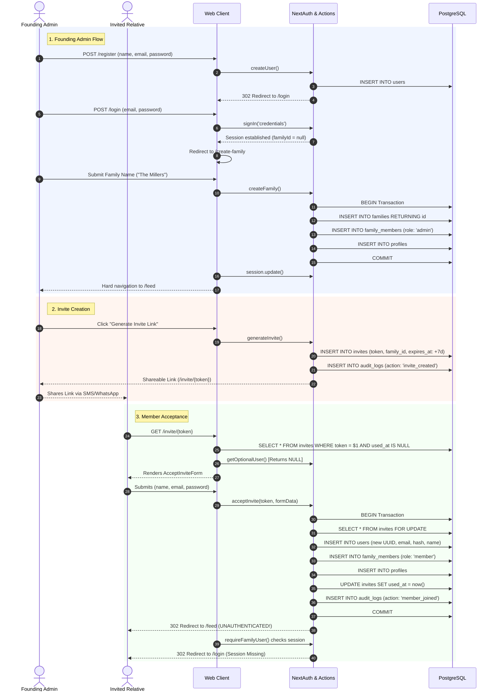
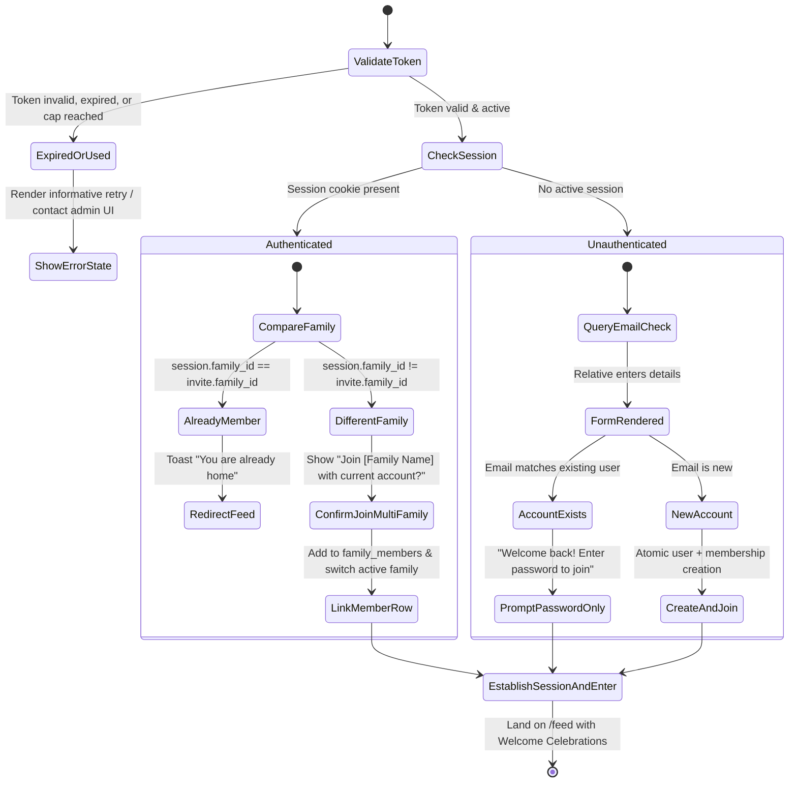

# 🏡 Kinship: Family Member Onboarding & Admin Governance Analysis

> **Document Type:** Architectural Analysis, Flow Evaluation & System Proposal  
> **Status:** Proposal & Documentation Only (No Implementation)  
> **Target Audience:** Engineering Team, Product Architects, Security & Operations  
> **Scope:** Current Onboarding Audit, Vulnerability & Pitfall Debate, Proposed Onboarding Architecture, and Global Platform Admin Dashboard Specification  

---

## 📑 Table of Contents

1. [Executive Summary](#1-executive-summary)
2. [Current Family Member Onboarding Flow](#2-current-family-member-onboarding-flow)
   - [2.1 The Founding Admin Flow](#21-the-founding-admin-flow)
   - [2.2 The Invite Generation Flow](#22-the-invite-generation-flow)
   - [2.3 The Invited Relative Flow](#23-the-invited-relative-flow)
   - [2.4 Current Relational Data Model & State Lifecycle](#24-current-relational-data-model--state-lifecycle)
3. [Pitfall Debate: Critical Failures & Architectural Tradeoffs](#3-pitfall-debate-critical-failures--architectural-tradeoffs)
   - [3.1 The Unauthenticated Redirect Loop (Silent Rejection)](#31-the-unauthenticated-redirect-loop-silent-rejection)
   - [3.2 Existing User Rejection (Unique Email Collision)](#32-existing-user-rejection-unique-email-collision)
   - [3.3 Ghost Session Detection on Invite Resolution](#33-ghost-session-detection-on-invite-resolution)
   - [3.4 Single-Use Token Fragility vs. Shared Family Links](#34-single-use-token-fragility-vs-shared-family-links)
   - [3.5 Action Redundancy & Logic Divergence (`createInvite` vs `generateInvite`)](#35-action-redundancy--logic-divergence-createinvite-vs-generateinvite)
   - [3.6 Absence of Role Granularity & Kinship Context](#36-absence-of-role-granularity--kinship-context)
   - [3.7 Multi-Family Blindspot & Lack of Tenant Switching](#37-multi-family-blindspot--lack-of-tenant-switching)
   - [3.8 Accessibility & Emotional Friction for Generational Users](#38-accessibility--emotional-friction-for-generational-users)
4. [Proposed Robust Onboarding Architecture](#4-proposed-robust-onboarding-architecture)
   - [4.1 Dual-Track Onboarding Taxonomy](#41-dual-track-onboarding-taxonomy)
   - [4.2 Streamlined Founding Admin Onboarding](#42-streamlined-founding-admin-onboarding)
   - [4.3 Smart Multi-Path Invite Resolution State Machine](#43-smart-multi-path-invite-resolution-state-machine)
   - [4.4 Atomic Concurrency & Safe Database Upsert Pipeline](#44-atomic-concurrency--safe-database-upsert-pipeline)
   - [4.5 Role Elevation & Kinship Tree Auto-Linking](#45-role-elevation--kinship-tree-auto-linking)
   - [4.6 Multi-Family Tenant Context & Family Switcher](#46-multi-family-tenant-context--family-switcher)
5. [The Need for an Admin Dashboard: Holistic View of All Families](#5-the-need-for-an-admin-dashboard-holistic-view-of-all-families)
   - [5.1 Tenant Family Admin vs. Platform Super Admin](#51-tenant-family-admin-vs-platform-super-admin)
   - [5.2 Strategic & Operational Drivers](#52-strategic--operational-drivers)
   - [5.3 Privacy-Preserving Zero-Knowledge Governance](#53-privacy-preserving-zero-knowledge-governance)
   - [5.4 Platform Admin Dashboard Feature Matrix](#54-platform-admin-dashboard-feature-matrix)
   - [5.5 Proposed Administrative Information Architecture](#55-proposed-administrative-information-architecture)
6. [Comparative Evaluation Matrix](#6-comparative-evaluation-matrix)
7. [Conclusion & Strategic Roadmap](#7-conclusion--strategic-roadmap)

---

## 1. Executive Summary

Kinship is engineered as **The Digital Living Room**—a sovereign, private sanctuary for multi-generational families. Unlike open social networks driven by follower graphs and public feeds, Kinship enforces strict data isolation bounded by a `family_id`. 

Because privacy and generational inclusivity are central to the platform, **the onboarding flow is the most critical user experience touchpoint in the application**. If an 80-year-old grandparent or non-technical aunt encounters a broken redirect, cryptographic failure, or duplicate account barrier when clicking an invite link from WhatsApp or iMessage, the family sanctuary fails before it begins.

This document performs an exhaustive audit of the current codebase implementation (`app/(public)/register`, `app/create-family`, `app/actions/invite.ts`, `app/lib/auth.ts`, `app/(public)/invite/[token]`, and `db/schema.ts`). It analyzes structural flaws and edge cases, debates the tradeoffs between open vs. restricted onboarding models, outlines a production-grade architecture for member acquisition, and establishes the operational requirement for a **Holistic Platform Admin Dashboard**.

---

## 2. Current Family Member Onboarding Flow

The existing codebase contains two primary user paths:
1. **Founding Admin:** Signs up independently, creates a family, and becomes the initial administrator.
2. **Invited Relative:** Receives a random 32-byte hex token, enters personal details on a public page, and is added to the family.



### 2.1 The Founding Admin Flow
- **Registration ([`app/(public)/register/page.tsx`](file:///C:/Users/DELL/freelancing/family-social/app/(public)/register/page.tsx)):** A prospective family administrator fills in their `name`, `email`, and `password`. The server action [`register()`](file:///C:/Users/DELL/freelancing/family-social/app/actions/auth.ts) calls `createUser()`, which inserts the user into `users` and redirects to `/login`.
- **Authentication ([`app/(public)/login/page.tsx`](file:///C:/Users/DELL/freelancing/family-social/app/(public)/login/page.tsx)):** The user must log in manually. Upon sign-in, NextAuth issues a JWT. Because `family_members` contains no matching record yet, `token.familyId` and `token.role` are `null`.
- **Guarded Interception:** Any visit to `/feed` or `/` detects the missing `familyId` and redirects to [`/create-family`](file:///C:/Users/DELL/freelancing/family-social/app/create-family/page.tsx).
- **Hearth Creation ([`app/create-family/action.ts`](file:///C:/Users/DELL/freelancing/family-social/app/create-family/action.ts)):** The admin enters a family name. The action executes a SQL transaction that creates the `families` record, assigns the creator as `'admin'` in `family_members`, and initializes the `profiles` record. The client calls `update()` to refresh the NextAuth session and hard-navigates to `/feed`.

### 2.2 The Invite Generation Flow
- An authenticated family admin accesses [`app/components/family/GenerateInviteButtons.tsx`](file:///C:/Users/DELL/freelancing/family-social/app/components/family/GenerateInviteButtons.tsx) or clicks the quick invite button in [`app/components/navigation/HearthHeader.tsx`](file:///C:/Users/DELL/freelancing/family-social/app/components/navigation/HearthHeader.tsx).
- The action creates a 32-byte cryptographic hex token with an expiration timestamp set to $T + 7\text{ days}$.
- The record is persisted in the `invites` table with `family_id` and `created_by`, and an audit event (`invite_created`) is appended to `audit_logs`.
- The frontend copies `${origin}/invite/${token}` to the user's clipboard.

### 2.3 The Invited Relative Flow
- The invited relative clicks the link and loads [`app/(public)/invite/[token]/page.tsx`](file:///C:/Users/DELL/freelancing/family-social/app/(public)/invite/[token]/page.tsx).
- The route queries the `invites` table joined with `families`. If the token is expired or already marked with `used_at`, it renders [`InvalidInvite`](file:///C:/Users/DELL/freelancing/family-social/app/components/invites/InvalidInvite.tsx).
- If valid, [`AcceptInviteForm.tsx`](file:///C:/Users/DELL/freelancing/family-social/app/components/invites/AcceptInviteForm.tsx) renders fields for `name`, `email`, and `password`.
- On submission, [`acceptInvite()`](file:///C:/Users/DELL/freelancing/family-social/app/actions/invite.ts) starts a transaction, locks the invite row with `FOR UPDATE`, generates a new user UUID, hashes the password, creates the `family_members` entry with `'member'` role, creates a `profiles` entry, sets `used_at = now()`, commits the transaction, and executes `redirect("/feed")`.

### 2.4 Current Relational Data Model & State Lifecycle

```
┌─────────────────────────┐       ┌─────────────────────────┐
│          users          │       │        families         │
├─────────────────────────┤       ├─────────────────────────┤
│ id: uuid (PK)           │       │ id: uuid (PK)           │
│ email: text (UNIQUE)    │       │ name: text              │
│ password_hash: text     │       │ created_by: uuid (FK)   │
│ name: text              │       │ created_at: timestamp   │
│ avatar_url: text        │       └────────────┬────────────┘
└───────────┬─────────────┘                    │
            │ 1                                │ 1
            │         ┌────────────────────────┘
            │         │
            ▼ N       ▼ N
┌─────────────────────────────────┐       ┌─────────────────────────┐
│         family_members          │       │         invites         │
├─────────────────────────────────┤       ├─────────────────────────┤
│ user_id: uuid (PK, FK -> users) │       │ id: uuid (PK)           │
│ family_id: uuid (PK, FK -> fam) │       │ family_id: uuid (FK)    │
│ role: text ('admin' | 'member') │       │ token: text (UNIQUE)    │
│ joined_at: timestamp            │       │ expires_at: timestamp   │
└─────────────────────────────────┘       │ used_at: timestamp      │
                                          │ created_by: uuid (FK)   │
                                          └─────────────────────────┘
```

---

## 3. Pitfall Debate: Critical Failures & Architectural Tradeoffs

While the current foundation provides database transactions and audit logging, critical architectural and edge-case pitfalls hinder reliability.

### 3.1 The Unauthenticated Redirect Loop (Silent Rejection)
- **The Defect:** In [`app/actions/invite.ts`](file:///C:/Users/DELL/freelancing/family-social/app/actions/invite.ts#L205), `acceptInvite()` calls `redirect("/feed")` immediately following database insertion. However, NextAuth is stateless and relies on encrypted HTTP-only session cookies. No session cookie has been minted because the user never passed through `signIn()`.
- **The Consequence:** The browser initiates a request to `/feed`. The layout executes [`requireFamilyUser()`](file:///C:/Users/DELL/freelancing/family-social/app/lib/auth.ts#L27), finds `session?.user?.id` to be `undefined`, and issues a `redirect("/login")`.
- **User Experience Impact:** The relative clicks "Accept Invitation & Enter Living Room", sees the screen flash, and is deposited onto the login screen without explanation. They assume the process failed, re-open the invite link, and are told: *"This invitation link has expired or has already been used."*

### 3.2 Existing User Rejection (Unique Email Collision)
- **The Defect:** `acceptInvite()` executes an unconditional:
  ```sql
  INSERT INTO users (id, email, password_hash, name) VALUES ($1, $2, $3, $4);
  ```
- **The Consequence:** If the invited person has ever registered for Kinship previously (or is invited to join a second family circle, such as in-laws or maternal relatives), PostgreSQL aborts the transaction with:
  `ERROR: duplicate key value violates unique constraint "users_email_key"`
- **The Tradeoff:** The current code treats user identity and family membership as 1:1, whereas real-world family structures are overlapping graphs.

### 3.3 Ghost Session Detection on Invite Resolution
- **The Defect:** In [`app/(public)/invite/[token]/page.tsx`](file:///C:/Users/DELL/freelancing/family-social/app/(public)/invite/[token]/page.tsx#L34):
  ```typescript
  const user = await getOptionalUser(); // Called with 0 arguments!
  ```
  Inspecting [`app/lib/user.ts`](file:///C:/Users/DELL/freelancing/family-social/app/lib/user.ts#L39):
  ```typescript
  export async function getOptionalUser(token?: string) {
    if (!token) return null;
    ...
  }
  ```
- **The Consequence:** `getOptionalUser()` *always* resolves to `null`.
- **Impact:** Even if a relative is currently logged into their Kinship account on the same device, the page fails to recognize their authenticated state. Instead of presenting a clean *"Join the Millers as [Display Name]"* button, it prompts them to register a new account.

### 3.4 Single-Use Token Fragility vs. Shared Family Links
- **The Current Behavior:** Once `acceptInvite()` finishes, it marks `used_at = now()`. The token is permanently dead.
- **The Friction in Real Families:** In practice, family organizers share links into a group chat (e.g., WhatsApp, iMessage, Signal) saying *"Hey everyone, join our new family living room here!"*. Under the current model:
  1. The fastest relative redeems the token.
  2. The remaining relatives click the link and receive a rejection banner.
  3. The administrator is bombarded with complaints that the link is broken.
- **The Security Counter-Debate:** 
  - *Argument for Single-Use:* High security, prevents unauthorized propagation if forwarded outside the family.
  - *Argument for Multi-Use with Approval Gate:* Natural for family group chats. An admin can set a capacity limit (e.g., max 10 members) or enable a *"Family Waiting Room"* where the admin confirms join requests.

### 3.5 Action Redundancy & Logic Divergence (`createInvite` vs `generateInvite`)
- In [`app/actions/invite.ts`](file:///C:/Users/DELL/freelancing/family-social/app/actions/invite.ts), two divergent functions exist:
  - `createInvite()`: Does not populate `id` or `created_by` in the `invites` table insert; passes `token` into audit log metadata.
  - `generateInvite()`: Uses `crypto.randomBytes(32)`, populates `id` with `gen_random_uuid()`, and sets `created_by`.
- Having multiple functions performing the same operation leads to maintenance drift, inconsistencies in DB records, and potential security holes.

### 3.6 Absence of Role Granularity & Kinship Context
- Every accepted invite hard-codes `role = 'member'`.
- There is no mechanism to:
  1. Designate a co-admin during invitation (e.g., spouse or sibling co-organizer).
  2. Assign kinship relation markers (e.g., *Grandmother*, *Father*, *Grandson*).
  3. Establish generation tier (Generation 1, 2, 3), forcing manual post-join configuration.

### 3.7 Multi-Family Blindspot & Lack of Tenant Switching
- In [`app/api/auth/[...nextauth]/route.ts`](file:///C:/Users/DELL/freelancing/family-social/app/api/auth/[...nextauth]/route.ts#L78):
  ```sql
  SELECT u.id, u.email, fm.family_id, fm.role
  FROM users u
  LEFT JOIN family_members fm ON fm.user_id = u.id
  WHERE u.email = $1
  ```
  And in [`requireFamilyUser()`](file:///C:/Users/DELL/freelancing/family-social/app/lib/auth.ts#L52):
  ```typescript
  const row = rows[0];
  ```
- Because SQL queries do not filter by an `active_family_id`, a user who belongs to multiple families is bound to whichever record PostgreSQL happens to return first. There is no active tenant session switcher.

### 3.8 Accessibility & Emotional Friction for Generational Users
- Modern multi-generational apps must cater to older relatives (boomers/seniors) and younger kin (Gen Alpha/Z).
- Forcing a multi-step journey (Register $\to$ Redirect $\to$ Login $\to$ Redirect $\to$ Create Family $\to$ Feed) induces high abandonment.
- The onboarding lacks progressive disclosure: entering avatar photos, kinship relationships, and family greetings should be streamlined during onboarding rather than hidden in sub-settings.

---

## 4. Proposed Robust Onboarding Architecture

To eliminate the flaws debated above, we specify a resilient, enterprise-grade onboarding architecture tailored to the Kinship privacy and kinship model.

### 4.1 Dual-Track Onboarding Taxonomy

```
                           ┌───────────────────────────────┐
                           │      KINSHIP ENTRY PORTAL     │
                           └───────────────┬───────────────┘
                                           │
                    ┌──────────────────────┴──────────────────────┐
                    ▼                                             ▼
     ┌─────────────────────────────┐               ┌─────────────────────────────┐
     │   TRACK 1: FOUNDING ADMIN   │               │   TRACK 2: INVITED RELATIVE │
     │   "Establish a Sanctuary"   │               │     "Join Family Circle"    │
     └──────────────┬──────────────┘               └──────────────┬──────────────┘
                    │                                             │
                    ▼                                             ▼
     ┌─────────────────────────────┐               ┌─────────────────────────────┐
     │ Unified Single-Action Flow  │               │ Token Type Resolution       │
     │ 1. Account Credentials      │               │ A. Direct Bound Invite      │
     │ 2. Family Name & Crest      │               │ B. Multi-Use Group Link     │
     │ 3. Instant Session Minting  │               │ C. QR Code Scan (In-Person) │
     └──────────────┬──────────────┘               └──────────────┬──────────────┘
                    │                                             │
                    ▼                                             ▼
     ┌─────────────────────────────┐               ┌─────────────────────────────┐
     │ Auto-Login & Landing        │               │ Smart State Engine          │
     │ Direct route to /feed with  │               │ - Auto-link existing user   │
     │ Family Warm-up Modal        │               │ - Auto-login new user       │
     └─────────────────────────────┘               └─────────────────────────────┘
```

### 4.2 Streamlined Founding Admin Onboarding
Eliminate the disjointed Register $\to$ Login $\to$ Create Family sequence.
- **Combined Registration & Hearth Setup:** Provide a unified onboarding experience where the founding admin provides their name, email, password, and initial family name simultaneously.
- **Atomic Initialization:** A single backend transaction creates:
  1. `users` record
  2. `families` record
  3. `family_members` record with `'admin'` role
  4. `profiles` record with display name and family association
  5. Initial `audit_logs` record
- **Programmatic Session Minting:** Immediately authenticate the newly created user upon completion, routing them directly into their customized living room feed without intermediate login screens.

### 4.3 Smart Multi-Path Invite Resolution State Machine
When an invite link (`/invite/[token]`) is loaded, the application executes a deterministic resolution state machine:



### 4.4 Atomic Concurrency & Safe Database Upsert Pipeline
The backend action handling invite acceptance must prevent race conditions and handle existing users gracefully:

```sql
-- 1. Lock the invitation record
SELECT id, family_id, max_uses, uses_count, expires_at, default_role, required_approval
FROM invites
WHERE token = $1 AND (expires_at > now()) AND (max_uses IS NULL OR uses_count < max_uses)
FOR UPDATE;

-- 2. Upsert User safely (if new, creates; if existing, retrieves ID)
INSERT INTO users (id, email, password_hash, name)
VALUES ($userId, $email, $passwordHash, $name)
ON CONFLICT (email) DO UPDATE 
SET name = COALESCE(users.name, EXCLUDED.name)
RETURNING id;

-- 3. Idempotently bind to family_members
INSERT INTO family_members (user_id, family_id, role, relation_label, generation_tier)
VALUES ($resolvedUserId, $familyId, $defaultRole, $relationLabel, $generationTier)
ON CONFLICT (user_id, family_id) DO UPDATE
SET role = EXCLUDED.role;

-- 4. Upsert Profile scoped to this family
INSERT INTO profiles (user_id, family_id, display_name, email)
VALUES ($resolvedUserId, $familyId, $name, $email)
ON CONFLICT (user_id, family_id) DO NOTHING;

-- 5. Increment usage count (Multi-use link support)
UPDATE invites
SET uses_count = uses_count + 1,
    used_at = CASE WHEN max_uses IS NOT NULL AND uses_count + 1 >= max_uses THEN now() ELSE used_at END
WHERE id = $inviteId;
```

### 4.5 Role Elevation & Kinship Tree Auto-Linking
Invites should carry optional metadata that auto-populates the family graph:
- **Pre-set Role:** Allow the organizer to issue a link specifically for a `co-admin` (full permissions) vs. standard `member` vs. `read-only` (suitable for junior children or supervised accounts).
- **Tree Node Binding:** If the admin created a tree node for *"Uncle Arthur (Gen 2)"*, the invite link can carry `tree_node_id`. Upon acceptance, the user account is automatically bound to that tree node, associating ancestral photos and recipes immediately.

### 4.6 Multi-Family Tenant Context & Family Switcher
To support modern interconnected families (e.g., belonging to both maternal and paternal sanctuaries):
1. **Schema Refinement:** Ensure `profiles` has a compound primary key: `PRIMARY KEY (user_id, family_id)`.
2. **Session Context:** Store `activeFamilyId` in the session JWT.
3. **Context Switching:** When a user visits their header dropdown, list all families linked via `family_members` (`SELECT f.id, f.name FROM family_members fm JOIN families f ON f.id = fm.family_id WHERE fm.user_id = $userId`). Switching families updates the active `familyId` in the session cookie and re-scopes all feed data without re-authentication.

---

## 5. The Need for an Admin Dashboard: Holistic View of All Families

A vital architectural component currently missing from Kinship is an **Administrative Dashboard**. 

### 5.1 Tenant Family Admin vs. Platform Super Admin
It is essential to separate these two distinct concepts:

| Dimension | Family Admin (Tenant Level) | Platform Super Admin (System Level) |
| :--- | :--- | :--- |
| **Persona** | Family Organizer / Household Head | System Operator, DevOps, Support Engineer |
| **Scope** | Single `family_id` boundary | All families, all tenants globally |
| **Current Location** | `/family` directory and `/family/invites` | *Non-existent in current codebase* |
| **Authority** | Invite relatives, delete posts, edit family name | Platform health, storage quotas, disaster recovery |
| **Data Visibility** | Full view of their own family's content | Aggregated operational metrics & metadata |

### 5.2 Strategic & Operational Drivers

Why does Kinship urgently require a Platform Super Admin Dashboard?

1. **Ecosystem Health & Adoption Telemetry:**
   Without a holistic view, operators have zero visibility into platform vitality. How many families are active? How many invites are sent vs. accepted? What is the abandonment rate at `/invite/[token]`? A platform dashboard surfaces real-time metrics on:
   - Total registered families
   - Active living rooms (DAU / WAU / MAU)
   - Invitation conversion funnel
   - Moments/memories created per day

2. **Storage & Infrastructure Governance:**
   Kinship supports media-rich memories (high-res photos, voice recordings, archival scans). Currently, uploads are stored locally in `public/uploads/avatar/` and `app/uploads/`. 
   - A platform admin must monitor storage utilization per family.
   - Detect runaway storage consumption.
   - Audit orphan files (e.g., failed uploads or unreferenced avatar images).
   - Plan migration from local disk storage to S3/Cloudflare R2 buckets.

3. **Lifecycle & Sanctuary Troubleshooting:**
   Family dynamics introduce complex edge cases that require operator intervention:
   - **Deceased Organizer Handover:** If the founding admin passes away or loses access, family members need a verified process to designate a new primary admin.
   - **Stuck Onboarding:** Debugging delivery failures or invalid tokens when an elder cannot connect.
   - **Family Merge Requests:** When two branches want to consolidate their historic archives.

4. **Security, Compliance & Abuse Mitigation:**
   Even in private sanctuaries, platforms must handle security and compliance:
   - Detecting brute-force attacks against password reset tokens or invite hashes.
   - GDPR / CCPA "Right to be Forgotten" processing: A family requesting permanent deletion requires a single-click purge of all relational rows (`families`, `posts`, `comments`, `media_assets`, `invites`, `audit_logs`) and storage assets.
   - Anomaly alerts for compromised accounts (e.g., suspicious IP shifts sending thousands of spam invites).

### 5.3 Privacy-Preserving Zero-Knowledge Governance
Kinship’s brand is built on sovereign family privacy (*"Zero Data Profiling, Zero Public Consumption"*). Therefore, the Super Admin dashboard must adhere to **Privacy-Preserving Architecture**:

> [!IMPORTANT]
> **The Sacred Living Room Principle:**  
> Platform administrators must **never** browse private family photos, read intimate journal posts, or listen to family voice memos. The Super Admin Dashboard should operate on **structural metadata**, not private content payloads.

- **Visible to Super Admin:** Family ID, creation date, hashed owner identifier, member count, total storage byte count, last active timestamp, error logs.
- **Redacted from Super Admin:** Post textual content, photo image blobs, private comments, audio story transcripts.

### 5.4 Platform Admin Dashboard Feature Matrix

```
┌────────────────────────────────────────────────────────────────────────┐
│                   PLATFORM SUPER ADMIN DASHBOARD                       │
├────────────────────────────────────────────────────────────────────────┤
│ ┌──────────────────┐ ┌──────────────────┐ ┌──────────────────────────┐ │
│ │ TOTAL FAMILIES   │ │ ACTIVE SANCTUARIES│ │ STORAGE ALLOCATION       │ │
│ │ 1,428            │ │ 892 (62.4%)      │ │ 412.6 GB / 1.0 TB        │ │
│ └──────────────────┘ └──────────────────┘ └──────────────────────────┘ │
├────────────────────────────────────────────────────────────────────────┤
│ [ 🏢 Families Directory ] [ 📈 Growth & Telemetry ] [ 🛡️ Security Audit ]│
│                                                                        │
│ Search Families: [ Search by name, family_id, or owner email...      ] │
│                                                                        │
│ ┌────────────────┬──────────┬─────────┬──────────┬──────────┬────────┐ │
│ │ Family Name    │ Creator  │ Members │ Storage  │ Created  │ Action │ │
│ ├────────────────┼──────────┼─────────┼──────────┼──────────┼────────┤ │
│ │ The Millers    │ rose@... │ 8 Kin   │ 1.2 GB   │ 2 mo ago │ Manage │ │
│ │ Sterling Clan  │ mark@... │ 14 Kin  │ 4.8 GB   │ 1 mo ago │ Manage │ │
│ │ Vance & Kin    │ sarah@.. │ 3 Kin   │ 240 MB   │ Yesterday│ Manage │ │
│ └────────────────┴──────────┴─────────┴──────────┴──────────┴────────┘ │
└────────────────────────────────────────────────────────────────────────┘
```

#### Core Operational Modules:
1. **Global Sanctuary Explorer:**
   - Filterable table of all families with status indicators (Active, Inactive, Pending Onboarding).
   - Drill-down drawer showing membership breakdown (number of Admins vs. Members), invite link activity, and storage quotas.
2. **Invite & Onboarding Audit Inspector:**
   - Real-time monitor of generated tokens, redemption status, conversion rates, and expired token garbage collection.
   - Anomaly detection flag for any family generating >50 invites within 1 hour.
3. **Storage & Media Fleet Console:**
   - Visual gauges of photo, voice note, and avatar distribution.
   - Orphaned asset cleanup utility to reclaim disk space from unreferenced files.
4. **Tenant Access & Succession Management:**
   - Reassign admin role if an organizer is locked out or deceased.
   - Temporarily suspend a family tenant if suspicious activity is detected.
5. **System Compliance & Data Erasure:**
   - Single-click automated purge for GDPR deletion compliance with cryptographic verification.
   - Complete family data export generation (ZIP archive containing JSON metadata and media assets).

### 5.5 Proposed Administrative Information Architecture

```
/admin
├── /dashboard              -> Global ecosystem metrics, DAU/WAU, storage gauges
├── /families               -> Directory of all families, status, search, and member counts
│   └── /[familyId]         -> Deep-dive metadata, audit logs, storage breakdown, role transfers
├── /invites                -> Global invite link ledger, conversion metrics, anomaly radar
├── /storage                -> Disk/Bucket health, media distribution, orphan asset cleanup
├── /audit-logs             -> Immutable global security log (auth events, deletions, role shifts)
└── /settings               -> Global system switches (maintenance mode, rate limits, storage quotas)
```

---

## 6. Comparative Evaluation Matrix

| Criterion | Current Implementation | Proposed Onboarding Architecture | Impact |
| :--- | :--- | :--- | :--- |
| **New Admin Setup** | 4-step sequence (Register $\to$ Login $\to$ Create Family $\to$ Feed) | 1-step unified wizard with auto-authentication | **High:** Reduces drop-off during family creation |
| **Existing User Acceptance** | Database crash (`duplicate key` on email) | Idempotent upsert & auto-membership binding | **Critical:** Resolves blocked invitation acceptances |
| **Post-Acceptance Landing** | Silent redirect loop to `/login` | Seamless session minting into `/feed` | **Critical:** Eliminates perceived broken links |
| **Session Detection** | Bugged (`getOptionalUser()` returns null) | Reads NextAuth session cookie directly | **High:** Instant one-click join for logged-in users |
| **Link Flexibility** | Single-use only; breaks in group chats | Configurable multi-use links + Waiting Room | **High:** Supports group chat distribution |
| **Role & Kinship Assignment** | Hard-coded `'member'`; manual tree editing | Role pre-assignment + Tree node binding | **Medium:** Streamlines profile setup |
| **Multi-Family Support** | Arbitrary DB row selection (`rows[0]`) | Context-aware active family switcher | **High:** Enables participation in multiple family circles |
| **Global Operations** | 0% visibility; direct DB queries required | Holistic Platform Super Admin Dashboard | **Strategic:** Enables monitoring, support, and compliance |

---

## 7. Conclusion & Strategic Roadmap

The current Kinship codebase provides a solid database schema, transactional isolation, and an elegant visual system. However, its onboarding pipeline suffers from session synchronization gaps, token fragility, and unique constraint collisions that directly impede user acquisition.

By implementing:
1. **A Unified Founding Admin Wizard** with immediate auto-login,
2. **An Idempotent Invite State Machine** that welcomes both new and existing users without session drops,
3. **Multi-Use Family Links** with optional admin approvals for group chat sharing, and
4. **A Platform Super Admin Dashboard** that provides holistic visibility while preserving zero-knowledge family intimacy,

Kinship can achieve the frictionless reliability required for multi-generational adoption.

---
*Document produced as architectural documentation only. No application code has been altered during the generation of this specification.*
