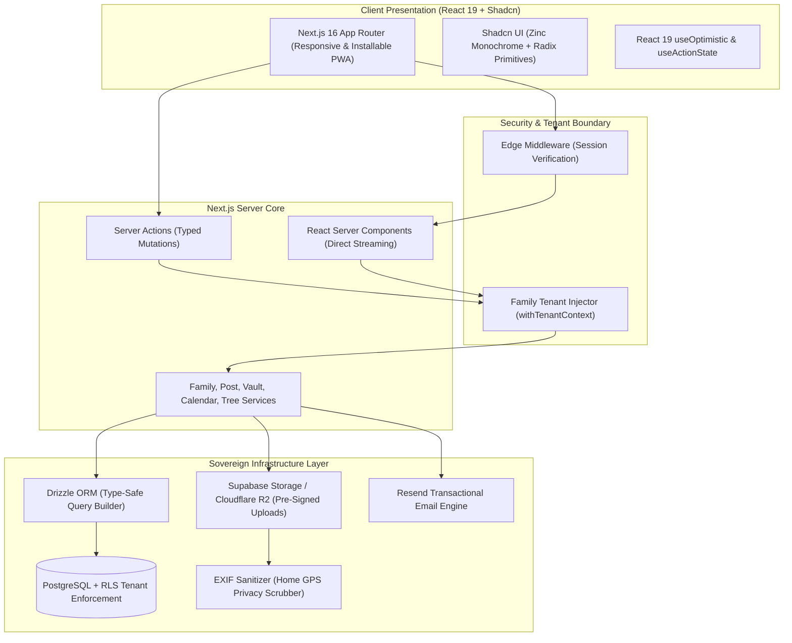

# 🏡 Kinship: The Digital Living Room – Architectural Specification & Visual Blueprint

> **Document Type:** Principal Architectural Proposal & Product Specification  
> **Status:** Finalized & Locked for Implementation  
> **Visual System:** Shadcn UI Monochrome (Zinc / Neutral Palette) + Tactile Pill Architecture  
> **Layout Model:** Asymmetrical Living Room Canvas (7:5 Editorial Desktop Grid) + Panoramic Hearth Header  
> **Typography:** Optimized 15px/1.65 Editorial Body & Harmonized 14px Sized Tab System  
> **Component Stack:** Shadcn UI + Radix UI Primitives + Tailwind CSS v4 + React 19  

---

## 🏛️ 1. Executive Summary & Brand Philosophy

Consumer social platforms are optimized for algorithmic outrage, public broadcasting, and advertiser data profiling. For families, this dynamic is harmful and intrusive.

**Kinship** re-architects family social communication as **The Digital Living Room**—a private, sovereign space where multi-generational families connect, preserve memories, and coordinate life together. 

Validated through the interactive prototype at [`app/prototype/page.tsx`](file:///C:/Users/DELL/freelancing/family-social/app/prototype/page.tsx), this specification is the single source of truth for engineering execution.

### Core Philosophy
1. **Intimate Walled Sanctuary:** Zero public discovery, zero followers, and absolute database-level multi-tenant isolation by `family_id`.
2. **Shadcn Monochrome Minimalism:** A clean, tactile, and premium aesthetic built on the default Shadcn Zinc/Neutral palette, providing visual quiet that lets family moments and memories stand out.
3. **Multi-Generational Usability:** Fluid and comfortable for 8-year-old grandchildren, busy parents, and 80-year-old grandparents through high-contrast typography, large touch targets (min 44px), and audio voice memo capabilities.

---

## 🖤 2. Visual System: Shadcn Monochrome & Pill Architecture

The visual identity is grounded in the **official Shadcn UI Monochrome (Zinc / Neutral)** palette, avoiding colored noise in favor of high-contrast elegance and structural clarity.

```
┌────────────────────────────────────────────────────────────────────────┐
│                   SHADCN MONOCHROME PALETTE SPECIFICATION              │
├────────────────────────────────────────────────────────────────────────┤
│  Light Mode: "Pure Chalk & Deep Zinc"                                  │
│  - Canvas Background:       #fbfbfd (Clean Warm Chalk)                 │
│  - Card Surfaces:           #ffffff (Pure Surface)                     │
│  - Subtle Fills:            #f4f4f6 (Zinc 100)                         │
│  - Hairline Borders:        #e6e6ec (Zinc 200)                         │
│  - Primary Text:            #09090b (Zinc 950)                         │
│  - Body Copy:               #18181b (Zinc 900)                         │
│  - Secondary Text:          #52525b (Zinc 600 - High WCAG AAA Contrast)│
│  - Primary Action:          #09090b (Solid Black with Pure White Text) │
├────────────────────────────────────────────────────────────────────────┤
│  Dark Mode: "Imperial Obsidian & Luminous Titanium"                    │
│  - Canvas Background:       #09090b (Deep Zinc 950)                    │
│  - Card Surfaces:           #141417 (Elevated Zinc 900)                │
│  - Subtle Fills:            #1f1f24 (Zinc 850)                         │
│  - Hairline Borders:        #282830 (Zinc 800)                         │
│  - Primary Text:            #fafafa (Zinc 50)                          │
│  - Body Copy:               #e4e4e7 (Zinc 200)                         │
│  - Secondary Text:          #a1a1aa (Zinc 400)                         │
│  - Primary Action:          #fafafa (Solid White with Zinc 950 Text)   │
└────────────────────────────────────────────────────────────────────────┘
```

### The Tactical Pill Architecture
The interface incorporates tactile pill elements to soften the geometry and enhance scannability:

1. **Segmented Tab Navigation Pills:** Full-width rounded capsule (`rounded-full`) with active elevated cards and embedded count badges (`{count}`).
2. **Interactive Topic Filter Pills:** Horizontal pill chips (`All Moments`, `📸 Photos Only`, `🎙️ Voice Stories`) that filter feed content in real-time.
3. **Categorical Badge Pills:** Top-right post markers (*"Milestone"*, *"Family Recipe"*, *"Quick Note"*).
4. **Generational Role Pills:** Family Tree kinship markers (*"Patriarch"*, *"Matriarch"*, *"Organizer"*, *"Editor"*, *"Youth"*).
5. **Interactive Action Capsules:** Rounded full-pill attendance toggles (*"✓ Coming (4)"*, *"Can't Go"*).
6. **Presence Indicator Pill:** Header live pulse capsule (*"● 6 Members &bull; Private Sanctuary"*).

---

## 📐 3. Finalized Layout Architecture: The Asymmetrical 7:5 Living Room Canvas

The layout features the validated **Panoramic Hearth Banner** and an **Asymmetrical 7:5 Editorial Desktop Grid**:

```
┌────────────────────────────────────────────────────────────────────────────────────────┐
│  [ Panoramic Hearth Scenery with Gradient Fade ]        [📍 Oakridge Estate • Est. 2010] │
├────────────────────────────────────────────────────────────────────────────────────────┤
│     ┌───────┐                                                                          │
│     │   M   │  The Miller Family  [🛡️ Private Sanctuary]                                │
│     │ MILLER│  “Cherishing small moments, holding close across every distance.”       │
│     └───────┘                                                                          │
│                 Circle: [Rose] [Mark] [Sarah] [Clara] [David] [Lucas]  [+ Invite]      │
├────────────────────────────────────────────────────────────────────────────────────────┤
│  01 324 Memories   │   02 3 Generations   │   03 Oct 6 Rose's 78th  │ 🗓️ Sunday Roast  │
└────────────────────────────────────────────────────────────────────────────────────────┘
┌─────────────────────────────────────────────┬──────────────────────────────────────────┐
│  PRIMARY STREAM & MODULES (7 Cols)          │  THE LIVING ROOM SHELF (5 Cols)          │
│                                             │                                          │
│  [ ☕ Stream (4) | 🎂 Milestones (2) | ... ]│  ┌────────────────────────────────────┐   │
│                                             │  │ "ON THIS DAY" POLAROID             │   │
│  [ Filter: 🔥 All | 📸 Photos | 🎙️ Voice ]  │  │ Sepia throwback keepsake           │   │
│                                             │  │ 3 Years Ago at Whispering Pines    │   │
│  ┌───────────────────────────────────────┐  │  └────────────────────────────────────┘   │
│  │ Floating Composer                     │  │                                          │
│  │ [Textarea] [Photos] [Voice] [Publish] │  │  ┌────────────────────────────────────┐   │
│  └───────────────────────────────────────┘  │  │ CELEBRATION RADAR                  │   │
│                                             │  │ Rose's 78th Birthday (In 4 Days)   │   │
│  ┌───────────────────────────────────────┐  │  │ David & Clara's 15th (Oct 24)      │   │
│  │ Magazine Post Card                    │  │  └────────────────────────────────────┘   │
│  │ - 15px/1.65 Editorial Body            │  │                                          │
│  │ - Interactive Audio Waveform          │  │  ┌────────────────────────────────────┐   │
│  │ - 2-Column Photo Collage              │  │  │ SUNDAY DINNER GATHERING            │   │
│  │ - Tactile Pill Reactions & Drawer     │  │  │ Oct 12 • Grandma's Backyard        │   │
│  └───────────────────────────────────────┘  │  │ Overlapping Attendee Avatar Ring   │   │
│                                             │  └────────────────────────────────────┘   │
└─────────────────────────────────────────────┴──────────────────────────────────────────┘
```

### Components of the Finalized Header
1. **Panoramic Hearth Canopy:** Subtle lake/hearth scenery fading seamlessly into the card surface with location pill badge (`Oakridge Estate • Established 2010`).
2. **Double-Ring Monogram Seal:** Double-hairline monogram seal (`w-20 sm:w-24`) with engraved family name (`MILLER`) and live emerald status dot.
3. **Motto & Title:** Crisp family name with private sanctuary shield pill and italicized motto: *“Cherishing small moments, holding close across every distance.”*
4. **Member Presence Facepile:** Real profile avatars with hover lifting transitions, paired with an interactive `+ Invite` button.
5. **Lower Architectural Vitals Shelf:** Numbered key statistics:
   - `01 324 Memories Shared`
   - `02 3 Generations Connected`
   - `03 Oct 6 Rose's 78th Birthday`
   - `Upcoming: Sunday Lawn Roast (Oct 12)`

---

## 💫 4. The 5 Core Family Activity Pillars

1. **Everyday Stream & Chatter:** Multi-photo collages, voice memos with animated waveform scrubber, kid quote templates, and inline discussion threads.
2. **The Vault & Nostalgia Engine:** Automatic *"On This Day"* throwback polaroid cards, chronological photo/video archive with zero aggressive compression.
3. **Celebrations & Life Milestones:** Perpetual birthday/anniversary calendar with celebratory status pills and collaborative digital cards relatives sign in advance.
4. **Generational Roots & Heritage:** Interactive 3-tier family tree with kinship role tags (*"Patriarch"*, *"Matriarch"*, *"Organizer"*, *"Youth"*) and biographical profiles.
5. **Gatherings & Event Coordination:** Sunday dinners and holiday gatherings with one-touch RSVP capsule buttons (*"✓ Coming (4)"*, *"Can't Go"*) and collaborative potluck item claiming.

---

## 🏗️ 5. System Architecture & Technical Stack



---

## 🗺️ 6. Phased Implementation Roadmap

### Phase 0: Design System & Core Foundation (Completed ✅)
- [x] Lock in finalized layout & visual specification in proposal.
- [x] Configure Shadcn Monochrome design tokens (`globals.css` / `tokens.css`).
- [x] Create core class merger utility [`app/lib/utils.ts`](file:///C:/Users/DELL/freelancing/family-social/app/lib/utils.ts) (`cn()`).
- [x] Expand Drizzle ORM schema in [`db/schema.ts`](file:///C:/Users/DELL/freelancing/family-social/db/schema.ts) to support celebrations, greeting messages, gatherings, RSVPs, potluck items, and generational tree nodes.
- [x] Build core UI primitives in `app/components/ui/` (`Badge`, `Button`, `Card`, `Avatar`, `Input`, `Label`, `Textarea`, `Separator`).

### Phase 1: Identity, Auth & Family Onboarding (Completed ✅)
- [x] Refactor NextAuth.js authentication (Google OAuth + Credentials) with typed `accessToken` session propagation.
- [x] Rebuild `/create-family` and `/invite/[token]` with welcoming typography and step-by-step role assignment.
- [x] Upgrade `/login`, `/register`, `/forgot-password`, and `/reset-password` to the Kinship brand layout and Shadcn monochrome components.

### Phase 2: Stream, Audio Waveform & Photo Collages (In Progress 🟢)
- [x] Asymmetrical 7:5 Living Room Canvas implemented in `/feed` and `(app)` layout.
- [x] Panoramic Hearth Header Canopy with live DB member facepile, dynamic stats tray, and tactile pill tabs.
- [x] Editorial post cards with 15px/1.65 body copy, reaction pills, and expandable comment threads.
- [x] Living Room Hearth sidebars (Celebration Radar, Sunday Potluck RSVP, Living Heritage Tree).
- [ ] Direct-to-bucket pre-signed upload API for photos and audio notes.
- [ ] Audio recorder integration & interactive waveform player component.

### Phase 3: Celebrations, Milestones & Event Gatherings
- [ ] Perpetual calendar tracking birthdays, anniversaries, and holidays with automatic milestone feed banners.
- [ ] Gathering & event coordinator (`/gatherings`) with one-touch RSVP capsule buttons and potluck checklists.
- [ ] Collaborative digital cards for birthdays that relatives sign in advance.

### Phase 4: The Family Vault & Living Heritage Tree
- [ ] The Vault (`/vault`): Chronological photo grid by Year/Month with "On This Day" archival polaroid card.
- [ ] Interactive Generational Family Tree viewer mapping immediate and extended relatives with kinship pills.
- [ ] One-click "Export Family Archive" tool (generates a zip containing original photos, audio notes, and stories).

### Phase 5: Mobile App Experience (PWA) & Final Polish
- [ ] PWA web manifest, home-screen installability, and service-worker caching for instant offline reading.
- [ ] Comprehensive multi-generational accessibility audit: large tap targets (min 44px), dynamic font scaling up to 200%, and screen reader support.
- [ ] Performance audit targeting sub-100ms LCP on mobile devices.

---

## 🔒 7. Security, Privacy & Data Invariants

1. **Family Isolation Invariant:** Every data read and write is strictly validated against the user's verified `family_id`. No cross-family leaks.
2. **EXIF Geolocation Stripping:** Digital cameras and smartphones embed home GPS coordinates in photo EXIF data. All uploads are stripped of GPS coordinates before saving.
3. **No Web Crawlers / No Ad Tracking:** Strict `noindex, nofollow` headers on all family spaces. No third-party ad pixels or tracking analytics.
4. **Full Data Portability:** Families own their data. A complete export is available to the family admin at any time.

---

## 💬 Verification & Prototype Reference

The validated interactive implementation of this specification is accessible at:
- **Prototype Source:** [`app/prototype/page.tsx`](file:///C:/Users/DELL/freelancing/family-social/app/prototype/page.tsx)
- **Live Local Route:** `http://localhost:3000/prototype`
